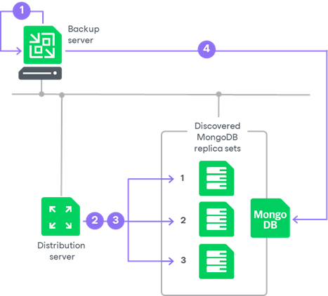

# Rescan Job

In this article

For automated discovery of protected computers, Veeam Backup & Replication uses the rescan job that runs on the backup server. Veeam Backup & Replication automatically creates this job once you create the protection group in the inventory. The rescan job runs upon schedule defined individually for every protection group in the protection group settings. By default, Veeam Backup & Replication is set up to perform discovery at 9:00 PM daily. You can adjust daily schedule in the protection group settings or define periodic schedule.

The rescan job itself is not displayed in the Veeam Backup & Replication console. However, you can start and stop rescan job sessions manually for a specific protection group, replica set or individual computer in the inventory. This may be helpful, for example, if new computers appeared in your infrastructure, and you want to discover these computers without waiting for the next scheduled rescan job session start. For details, see [Rescanning Protection Group](mongo_protection_group_rescan.md) and [Rescanning Protected Computer](mongo_protected_computers_rescan.md).

You can view statistics for currently running and already performed rescan job sessions. For details, see [Viewing Rescan Job Statistics](mongo_report_rescan_job_stats.md).

How Rescan Job Works

When the rescan job is started, Veeam Backup & Replication performs the following operations:

1. Obtains settings specified for the protection group from the configuration database. The settings include a list of MongoDB replica sets and computers to scan, accounts to connect to replica sets, and so on.

1. Connects to each computer in a replica set that was added to the backup scope during the protection group configuration. Veeam Backup & Replication can connect to the added computers using a certificate-based authentication or using an SSH connection and administrator credentials depending on [the protection group configuration](mongo_protection_group_scope_computers.md). After the successful connection, Veeam Backup & Replication collects information about the MongoDB daemon process (mongod). To learn about mongod, see [MongoDB documentation](https://www.mongodb.com/docs/manual/reference/program/mongod/).

Keep in mind the following:

* If a computer included in a replica set is not added to the backup scope by the user, Veeam Backup & Replication does not scan it.
* To connect to a Linux computer using SSH, this Linux computer must be added to the list of trusted hosts. For details, see [Configuring Security Settings](security_settings.md).

1. Deploys Veeam components on each newly discovered Linux computer that is added to the backup scope and has mongod detected.

|  |
| --- |
| Important |
| If the number of nodes in a replica set changes, you must update the protection group configuration and rescan the protection group. Otherwise, Veeam Backup & Replication does not detect changes of a replica set. For details, see [Editing Protection Group Settings](mongo_protection_group_edit.md) and [Rescanning Protection Group](mongo_protection_group_rescan.md). |

As a part of component deployment process, Veeam Backup & Replication performs the following operations:

1. Deploys Veeam Installer Service on each newly discovered computer with the mongod detected.
2. Veeam Installer Service running on the computer collects information about the computer and sends it to Veeam Backup & Replication. The collected data includes details on the computer (platform, host name, guest OS, IP address, BIOS UUID) and Veeam Agent for Linux (product presence on the computer and version).
3. Veeam Backup & Replication uploads Veeam components from the distribution server to the discovered computer.
4. Veeam Installer Service deploys Veeam components on the target computer. For example: Veeam Mongo Agent and Veeam Agent for Linux. For more information on Veeam components required to back up MongoDB data, see [Solution Architecture](mongo_hiw.md).
5. Veeam Installer Service retrieves the TLS certificate with a public key from the backup server and saves the TLS certificate with a public key in the Veeam Agent configuration database on the target computer. Veeam Backup & Replication will use this certificate to connect to Veeam Agent.
6. Veeam Backup & Replication collects information about mongod on the computer. Veeam Backup & Replication will use this information for an application backup policy to select the node that will be a backup source. To learn more, see [Backup Source Selection](mongo_rescan_job_db_detection.md).

1. Connects to each MongoDB replica set using MongoDB Wire Protocol and salted challenge response authentication mechanism (SCRAM) with or without transport layer security (TLS) depending on [the protection group configuration](mongo_protection_group_scope_deployments.md). During this step, Veeam Backup & Replication updates information about nodes in a replica sets that we added to the backup scope. Veeam Backup & Replication will use this information for an application backup policy to select the node that will be a backup source. For details about the collected information, see [Backup Source Selection](mongo_rescan_job_db_detection.md).

Related Tasks

* [Creating Protection Groups](protection_group_create.md)
* [Rescanning Protection Group](protection_group_rescan.md)
* [Rescanning Protected Computer](protected_computers_rescan.md)
* [Viewing Rescan Job Statistics](report_rescan_job_stats.md)

Page updated 11/21/2024

Page content applies to build 13.0.1.1071
