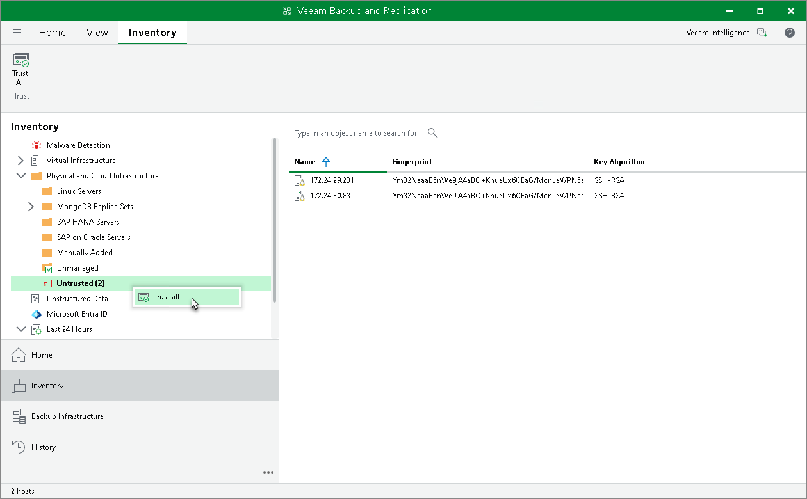
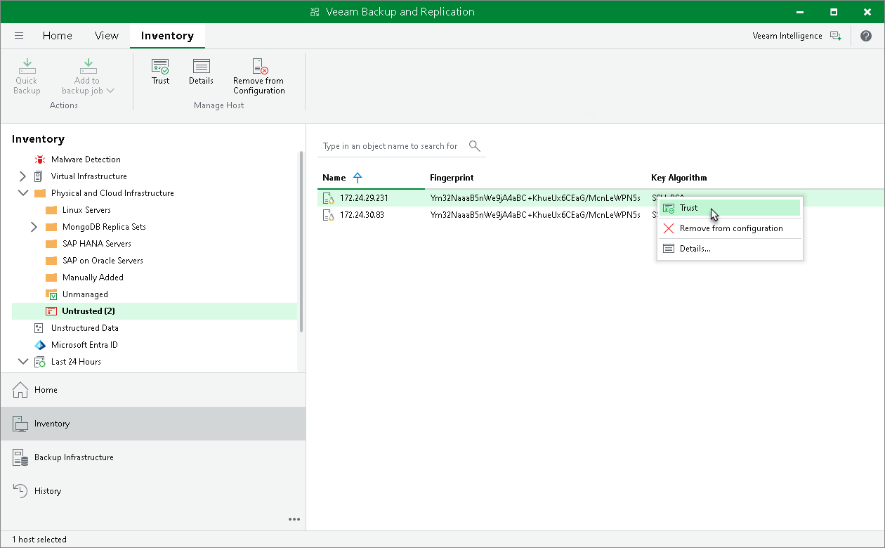

# Adding Computers to Trusted Hosts List

In this article

After you enable the Add unknown hosts to the list manually (more secure) option in Veeam Backup & Replication settings, Linux-based computers whose SSH fingerprints are not stored in the Veeam Backup & Replication database become unable to communicate to the Veeam backup server. During discovery, Veeam Backup & Replication puts such computers to the Untrusted protection group. To start managing an untrusted computer, you must manually validate the SSH fingerprint and add the computer to the list of trusted hosts in the Veeam Backup & Replication console.

To add a computer to the list of trusted hosts:

1. Open the Inventory view.
2. In the inventory pane, expand the Physical Infrastructure node and click Untrusted.
3. In the working area, Veeam Backup & Replication will display discovered computers that you can add to the list of trusted hosts. Check SSH fingerprints of the computers and add them to the list of trusted hosts in one of the following ways:

* To add all computers at once to the list of trusted hosts, select the Untrusted node in the inventory pane and click Trust All on the ribbon or right-click the Untrusted node and select Trust all.

* To add a specific computer to the list of trusted hosts, select the necessary computer in the working area and click Trust on the ribbon or right-click the computer and select Trust.

Page updated 11/21/2024

Page content applies to build 13.0.1.1071
