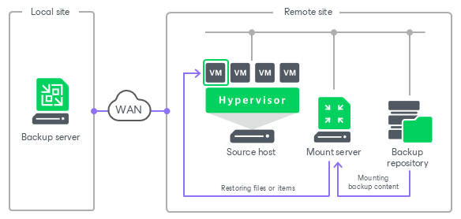

# Mount Servers

In this article

The mount server is a server required for restores that work with guest OS files and application items. To access files or items stored in a backup file, Veeam Backup & Replication mounts the content of the backup to the mount server. Only after the content is mounted, Veeam Backup & Replication can get files and copy them to the restore destination.

The mount server is required if you perform the following operations:

* [Guest OS file restore](guest_file_recovery.md)
* [Application items restore](restore_veeam_explorers.md)
* [Secure restore](av_scan_about.md)
* [Instant recovery](instant_recovery.md)
* [Instant disk recovery](instant_disk_recovery.md)
* [Instant file share recovery](performing_instant_file_share_recovery.md)
* Restore of specific objects from [file backup](file_share_recovery_restore_files_folders.md) and [object storage backup](os_data_recovery_restore_individual_objects.md)

To reduce the load on the network and speed up the restore process, the mount server must be located in the same site as the backup repository where backup files are stored. In this case, you will be able to keep the traffic in one site. If the mount server is located in some other site, the data will travel across the network between the sites.

|  |
| --- |
| Note |
| In some scenarios, Veeam Backup & Replication can mount content of backups to machines other than mount servers. For more information, see [Mount Points and Restore Scenarios](guest_restore_scenarios.md). |

Mount Server Deployment

The mount servers are created for every backup repository and are associated with it. When you [configure a backup repository](repository_mount_server.md), you specify to which servers you want to assign the roles of the Windows mount server and the Linux mount server.

The mount servers are platform-specific. You can assign the role of the Windows mount server to any 64-bit [Microsoft Windows machine added to the backup infrastructure](add_windows_server.md), the role of the Linux mount server to a RHEL/Rocky-based [Linux machine added to the backup infrastructure](add_linux_server.md). This machine and the backup repository must be located as close to each other as possible. If you have several sites, it is recommended to configure at least one mount server in each site.

If the mount servers are not specified manually in the backup repository settings or are unavailable, Veeam Backup & Replication fails over to the default mount servers. Veeam Backup & Replication assigns the roles of the default mount servers to the first suitable platform-specific infrastructure component added:

* The default Linux mount server role is automatically assigned to Veeam Software Appliance.
* The default Windows mount server role is suggested for the first Microsoft Windows server added as the managed server. If the suggestion is declined and there is no default Windows mount server configured, the role of the default Windows mount server is automatically assigned to the first Windows mount server [selected for a backup repository](repository_mount_server.md).

However, you can manually reassign the default Windows and Linux mount server roles to the platform-specific servers added as managed server and meeting the system requirements. For more information, see [Installing Mount Service](install_mount_service.md).

It is recommended to [enable the vPower NFS Service](repository_mount_server.md) on the mount server. In this case, the mount server acts as the vPower NFS server. For more information, see [Veeam vPower NFS Service](vpower_nfs_service.md).

|  |
| --- |
| Note |
| Consider the following:   * For scale-out backup repositories, you must specify the mount server for every extent. * Every backup repository added to the backup infrastructure must have the Linux mount server configured. You cannot set the Linux mount server field to Not specified. |

Mount Server Services and Components

Mount servers run light-weight services that take a few seconds to deploy. Deployment is fully automated. Veeam Backup & Replication installs the following services:

* Veeam Mount Service mounts backups and replicas for file-level access, browsing the guest file system and restoring guest OS files and application items.

When you assign the default mount server role to one of the servers in your backup infrastructure, Veeam Backup & Replication will prompt you to install the mount service on it. To learn how to do that, see [Installing Mount Service](install_mount_service.md).

* Veeam Data Mover Service/Veeam Transport Service handles traffic.
* Veeam vPower NFS Service (if you enable it when configuring the mount server) implements vPower NFS server that enables running virtual machines directly from backup files.
* Veeam Threat Hunter Service runs a [Veeam Threat Hunter](malware_detection_scan_backup_veeam_threat_hunter.md) scan.

Requirements for Mount Servers

Before you assign the role of a mount server, check the following requirements and limitations:

* The machine must meet the system requirements. For more information, see [System Requirements](system_requirements.md#mount).

* The mount server must have access to the backup repository with which it is associated and to the original VM (the VM to which you restore files or application items). For restore from storage snapshots in VMware vSphere environments, the mount server must also have access to the ESXi host on which the temporary VM is registered.
* For Linux mount servers, consider the following:

* The Linux server must have the libmsi1 and ntfs-3g packages installed.
* Veeam Infrastructure Appliance deployed from Veeam Backup & Replication JeOS ISO file does not require any additional installations and is ready to use. For more information, see [Installing Veeam Infrastructure Appliance with ISO](linux_infrastructure_appliance_install.md).
* Veeam Software Appliance and Veeam Infrastructure Appliance do not support the installation of third-party software. If you plan to use the [antivirus scan feature for secure restore](secure_restore_antivirus.md), make sure the Linux mount server role is assigned to a different Linux machine.

* The following features require a Microsoft Windows mount server and may fail if the Windows mount server or the default Windows mount server is not configured:

* [VMware replication job with Re-IP rules](replica_reip_vm.md)
* [Application item restore](restore_veeam_explorers.md)
* [Secure restore](av_scan_about.md) for workloads with ReFS volumes
* [SureBackup](surebackup_recovery_verification.md)
* [Guest OS file restore](guest_file_recovery.md) for Microsoft Windows workloads with ReFS volumes, or from workloads with data deduplication enabled for some volumes

Related Topics

* [Mount Points and Restore Scenarios](guest_restore_scenarios.md)
* [Secure Restore](av_scan_about.md)
* [Adding Microsoft Windows Repositories](repo_add.md)
* [Installing Mount Service](install_mount_service.md)

Page updated 9/19/2025

Page content applies to build 13.0.1.1071
