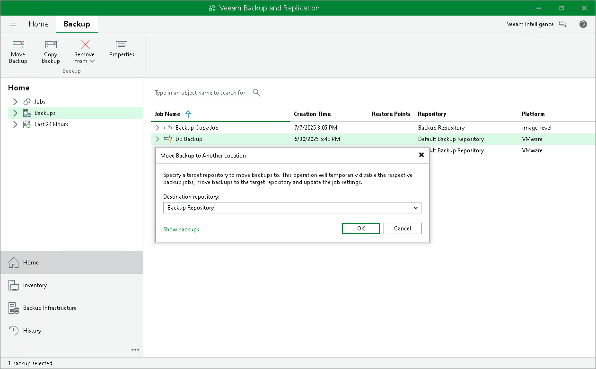
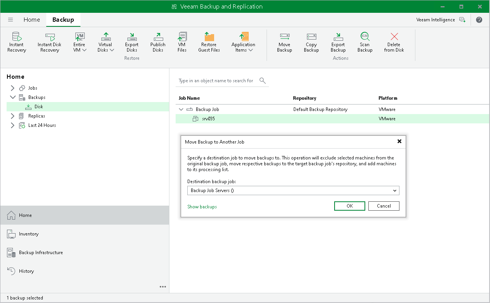

# Moving Backups

In this article

Veeam Backup & Replication allows you to move all backups of a backup job to another repository or to move specific workloads and their backups to another job.

Moving Backups to Another Repository

For information on the move operation, how it works and its limitations, see [Backup Move](backup_moving_hv.md).

To move backups to another repository and target a job to this repository, do the following:

1. Open the Home view.
2. In the [inventory pane](vbr_ui.md), select the Backups node.
3. In the working area, select the necessary job.
4. Right-click the job and select Move backup. Alternatively, click Move Backup on the ribbon.
5. In the Move Backup to Another Location window, select the repository to which you want to move backups.

Veeam Backup & Replication will reconfigure and target the backup job to the selected repository.

1. Click OK.

Alternatively, you can change the repository in the job settings.

Moving Backups to Another Job

For information on the move operation, how it works and its limitations, see [Backup Move](backup_moving_hv.md).

To move backups to another job:

1. Open the Home view.
2. In the [inventory pane](vbr_ui.md), select the Backups node.
3. In the working area, expand the necessary backup job and select workloads.

|  |
| --- |
| Note |
| You can move individual workloads and their backups only if backups are [per-machine](per_vm_backup_files.md) with separate metadata files for each workload. |

1. Right-click one of the selected workloads and click Move backup. Alternatively, click Move Backup on the ribbon.
2. In the Move Backup to Another Job window, select the backup job to which you want to move backups.

Veeam Backup & Replication will include workloads into the selected job and exclude workloads from the original job. Backups of the selected workloads will be moved to the repository to which the selected job is targeted.

1. Click OK.

Managing Failed Activities

If the move operation fails, Veeam Backup & Replication assigns the User action required status to it. In this case, you need to decide how to finish the operation: retry the move operation for failed workloads, cancel all changes, or move failed workloads but detach their backups. If you detach failed backups, the target job creates active full backups for failed workloads and continues backup chains for other workloads. The detached backups are shown in a node with the (Orphaned) postfix in the inventory pane.

|  |
| --- |
| Note |
| The original job will still be in the disabled state until you finalize the failed move operation. |

To finalize the move operation:

1. Open the Home view.
2. In the inventory pane, select the Last 24 Hours node.
3. Right-click the failed move session and select the required action. Alternatively, select the required action on the ribbon.

Page updated 8/29/2025

Page content applies to build 13.0.1.1071
