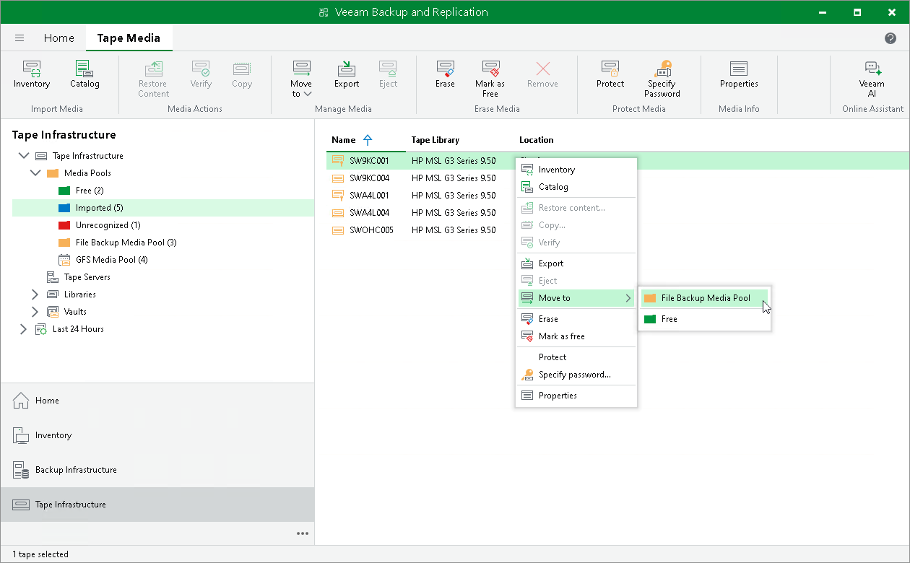

# Moving Tapes to Another Media Pool

In this article

Veeam Backup & Replication allows you to move tapes between media pools. You can move tapes between media pools and GFS media pools, and from and to the Free media pool. Veeam Backup & Replication uses tapes from the Free media pool to automatically add them to other media pools and write backups to them if there are no more free tapes available in those media pools.

You can move tapes between media pools only if the media pools span the same tape libraries.

You cannot manually move tapes to Imported, Unrecognized or Retired media pools.

|  |
| --- |
| Important |
| When you move a tape to any media pool, Veeam Backup & Replication marks this tape as free. |

To move tapes from one media pool to another:

1. Open the Tape Infrastructure view.
2. Navigate to the list of tapes either under the Media Pools or under the Libraries > LibraryName node > Media > Online.
3. Select tapes you want to move and click Move to on the ribbon. Choose the target media pool from the list.

Alternatively, you can right-click selected tapes and choose Move to Media Pool. Next, choose the target media pool from the list.

|  |
| --- |
| Note |
| Consider the following:   * You cannot move tapes that are protected. To move such tapes, you need to switch the protection off first. * WORM tapes can only be moved to the WORM media pool. Do not mix standard and WORM tapes in one media pool. |

Page updated 6/14/2024

Page content applies to build 13.0.1.1071
