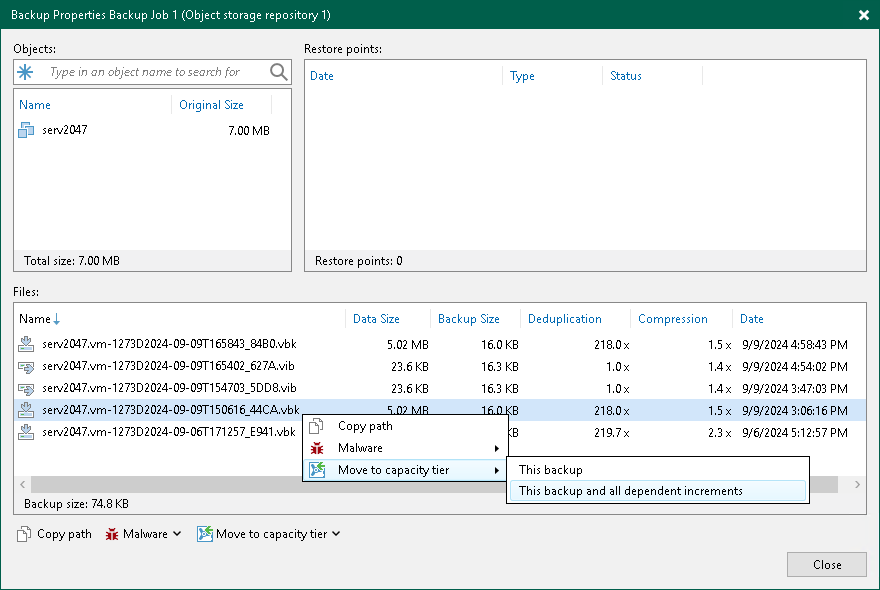

# Manually Moving Backups to Capacity Tier

In this article

The Move to capacity tier option allows you to manually offload selected backup files to capacity extents.

Consider that backup files you want to offload must belong to an inactive backup chain. For more information, see [Backup Chain Detection](capacity_tier_inactive_backup_chain.md).

To move backup data to capacity tier, do the following:

1. Open the Home view.
2. In the [inventory pane](vbr_ui.md), select the Backups > Disk node (for backup repositories) or Backup > Object Storage (for object storage repositories) node.
3. In the working area, right-click a backup job and select Properties.
4. In the Properties window, right-click a backup file that you want to offload and select Move to capacity tier.

Alternatively, you can use the Move to capacity tier control at the bottom.

1. Select the necessary backup file and specify the offload options:

* This backup and its dependencies — to offload the selected incremental backup file (VIB) and all increments related to it.
* This backup — to offload the selected full backup file (VBK) only.
* This backup and all dependent increments — to offload the selected full backup file (VBK) along with its increments.

Related Topics

* [Backup Chain Detection](capacity_tier_inactive_backup_chain.md)
* [Viewing Capacity Tier Sessions Statistics](offload_session_results.md)

Page updated 9/9/2024

Page content applies to build 13.0.1.1071
