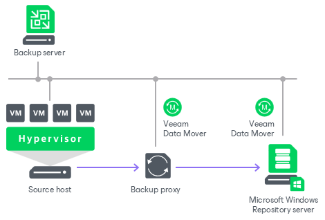

# Microsoft Windows Server

In this article

You can use a Microsoft Windows server with local or directly attached storage as a backup repository. The storage can be a local disk, directly attached disk-based storage (such as a USB hard drive), or iSCSI/FC SAN LUN in case the server is connected into the SAN fabric.

Microsoft Windows Repository Deployment

To communicate with a Microsoft Windows-based repository, Veeam Backup & Replication uses two [Veeam Data Movers](veeam_transport_service.md) that are responsible for data processing and transfer:

* Veeam Data Mover on a VMware or off-host backup proxy
* Veeam Data Mover on the Microsoft Windows repository

When any job addresses the backup repository, Veeam Data Mover on the VMware or off-host backup proxy establishes a connection with Veeam Data Mover on the backup repository, enabling efficient data transfer over LAN or WAN.

The Data Mover is installed automatically when you add a server to Veeam Backup & Replication as a managed server.

vPower NFS Server

Windows repositories can be configured to function as vPower NFS Servers. In this case, Veeam Backup & Replication will run the Veeam vPower NFS Service directly in the backup repository (namely, on the managing Windows server to which storage is attached) and provide ESXi hosts with transparent access to backed-up VM images stored on the backup repository. For more information, see [Veeam vPower NFS Service](vpower_nfs_service.md).

|  |
| --- |
| Note |
| vPower NFS settings are not applicable in Microsoft Hyper-V environments. |

Requirements for Microsoft Windows Server Based Repositories

A machine performing the role of a repository must meet the following requirements:

* The role of the repository can be assigned to a Microsoft Windows machine (physical or virtual). The machine must meet the system requirements. For more information, see [System Requirements](system_requirements.md#repo).

* You must add the machine to the Veeam Backup & Replication console as a managed server.

* If you want to use Fast Clone in the Microsoft Windows-based backup repository, the machine must also meet requirements listed in section [Fast Clone](backup_repository_block_cloning.md#microsoft_smb).

Related Topics

* [Adding Microsoft Windows Repositories Using Console](repo_add.md)
* [Adding Microsoft Windows Repositories Using Web UI](add_repo_web.md)

Page updated 9/5/2025

Page content applies to build 13.0.1.1071
