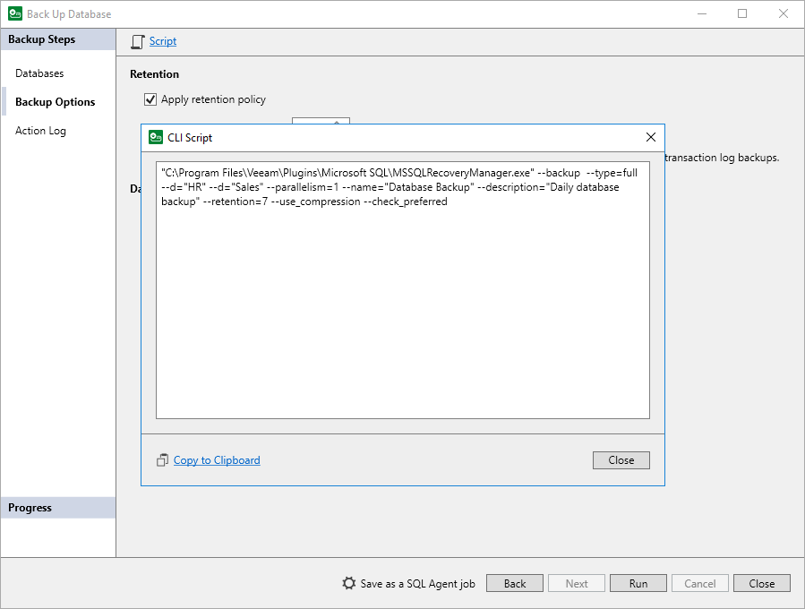

# Exporting Backup Settings to Custom Script

In this article

You can export backup settings specified for Veeam Plug-In for Microsoft SQL Server to a custom script. This may be helpful if you want to back up Microsoft SQL Server databases using a third-party scheduling tool.

To export backup settings to a custom script:

1. At the Databases, Backup Options or Action Log step of the Back Up Database wizard, click Script.
2. In the CLI Script window, review the command to back up Microsoft SQL Server data and click Copy to Clipboard.

You will be able to use the command in a custom script with an external scheduling tool.

|  |
| --- |
| TIP |
| You can modify parameters of the command used to back up Microsoft SQL Server data if necessary. For information about available backup parameters, see [Performing Backup with Command-Line Interface](mssql_configure_backup_cmd.md). |

Exit Codes

The MSSQLRecoveryManager.exe command can return the following exit codes:

* -1 — the service returns this code when the backup or restore process fails with an error.
* 0 — the service returns this code when the backup or restore process is successful.

Page updated 5/3/2024

Page content applies to build 13.0.1.1071
