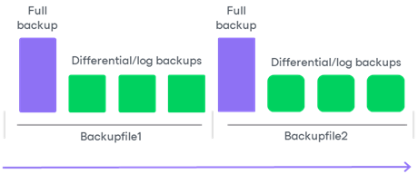

# Backup Chain

A sequence of backups created with Veeam Plug-In for a Microsoft SQL Server database makes up a backup chain. The backup chain can be described at two levels: physical level and logical level.

* At the physical level, the backup chain is a sequence of backup files created by Veeam Plug-In in the backup repository. In contrast to image-level backups created with Veeam Backup & Replication for which a separate backup file is created during each backup session, backup files created with Veeam Plug-In contain data backed up within multiple backup sessions. Thus, instead of a chain of full and incremental backup files, Veeam Plug-In creates its own set of backup files in the backup repository.
* At the logical level, the backup chain consists of a full backup of a Microsoft SQL Server database and its dependent differential backups and log backups. Backups in the backup chain form a set of restore points. Restore points correspond to the time when the backup was performed and let you recover the database to the necessary state.

To create a backup chain, Veeam Plug-In implements the forward incremental backup method.

Full backup, its dependent differential backups and log backups of a Microsoft SQL Server database reside in the same backup file. Depending on what backup settings you specify, the backup chain can also span multiple backup files. This mechanism differs from the one for image-level backups created with Veeam Backup & Replication where one restore point generally corresponds to one backup file.

The logical sequence of backups is hidden from the user — the user cannot get information about available restore points from a sequence of backup files in the backup repository. The user can view and select restore points when restoring a database. For more information, see [Performing Restore](mssql_db_restore.md).

For information about types of backup files that Veeam Plug-In creates and rules for creating the backup chain, see [Backup Files](#files) and [How Backup Chain Works](#chain).

Backup Files

Veeam Plug-In for Microsoft SQL Server creates and maintains the following types of backup files:

* .VAB — backup files that store a copy of Microsoft SQL Server data.
* .VASM — backup metadata files that store information about the backup. A .VASM file is created for each .VAB file. The .VASM files are used by Veeam Backup & Replication to get information about Veeam Plug-In backups.
* .VACM — backup metadata files that store information about the backup job. Veeam Plug-In creates one .VACM file for the backup job.

All backup files created by the backup job reside in a dedicated job folder in the backup repository. For example, if the name of the backup job in Veeam Backup & Replication is SRV01 MSSQL backup (Backup Vol 01), Veeam Backup & Replication will create the SRV01 MSSQL backup (Backup Vol 01) folder on the target backup repository and store all backup files created by this job in this folder.

How Backup Chain Works

Veeam Plug-In for Microsoft SQL Server creates the backup chain in the following way:

1. During the first backup session, Veeam Plug-In for Microsoft SQL Server creates a new .VAB file in the backup repository and writes to this file data of the full backup. This backup becomes a starting point in the backup chain.

Veeam Plug-In writes data of each backed-up database to a separate backup file. For example, if you back up 2 databases, Veeam Plug-In will create 2 .VAB files in the backup repository.

1. During subsequent backup sessions, Veeam Plug-In for Microsoft SQL Server writes the backup data either to the same .VAB file or to a new .VAB file. A new .VAB file is created if one of the following cases:

* If Veeam Plug-In performs full backup.
* If the previous backup file created for the database is older than 24 hours.

|  |
| --- |
| Note |
| If the backup is targeted at a scale-out backup repository, Veeam Plug-In selects an extent where to write the backup data according to the placement policy specified for the scale-out backup repository (Data locality or Performance). After that, Veeam Plug-In applies the same algorithm to choose whether to write the backup data to an existing backup file or new backup file. |

