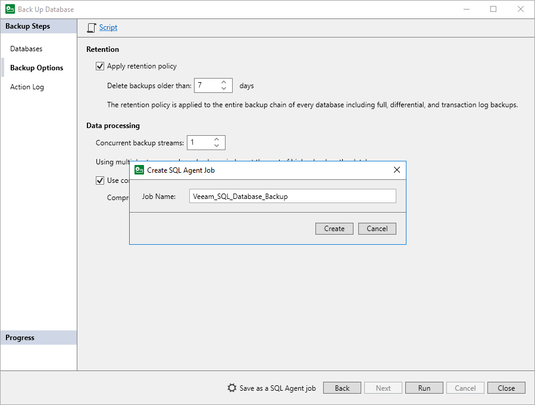
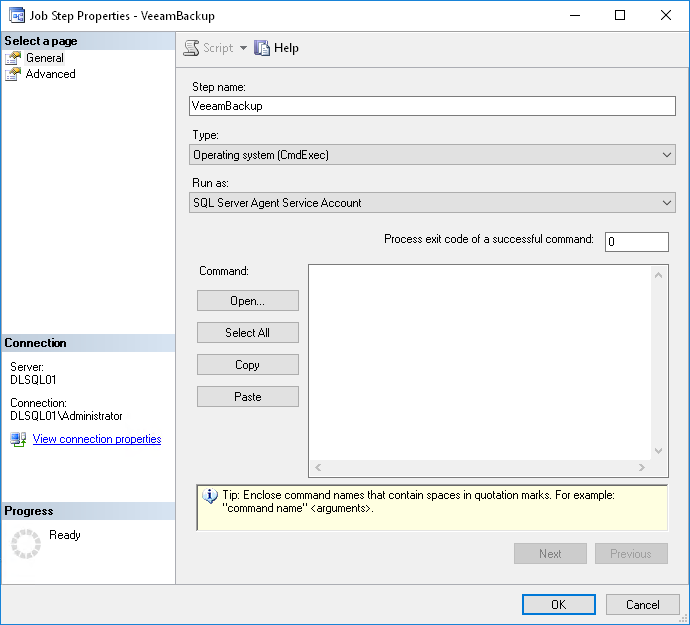

# Saving Backup Settings as SQL Agent Job

In this article

You can save backup settings specified for Veeam Plug-In for Microsoft SQL Server as an SQL Agent job. This may be helpful if you have Microsoft SQL Server Management Studio in your environment and want to use its functionality to apply schedule to a Microsoft SQL Server backup job.

To save backup settings as an SQL Agent job:

1. At the Backup Options step of the Back Up Database wizard, click Save as a SQL Agent Job.
2. In the Create SQL Agent Job window, specify the name for the SQL Agent job and click Create.

The SQL Agent job will become available in the Jobs node in Microsoft SQL Server Management Studio, and you will be able to specify schedule in the job properties. During the SQL Agent job configuration, Veeam Plug-In for Microsoft SQL Server creates a step that runs the MSSQLRecoveryManager.exe command with the specific parameters.

|  |
| --- |
| Tip |
| Consider [exit codes](#exit) that the MSSQLRecoveryManager.exe command can return. |

Exit Codes

The MSSQLRecoveryManager.exe command can return the following exit codes:

* -1 — the service returns this code when the backup or restore process fails with an error.
* 0 — the service returns this code when the backup or restore process is successful.

Make sure that you specify 0 in the Process exit code of a successful command field when you configure the SQL Agent job properties using Microsoft SQL Server Management Studio.

Page updated 11/6/2025

Page content applies to build 13.0.1.1071
