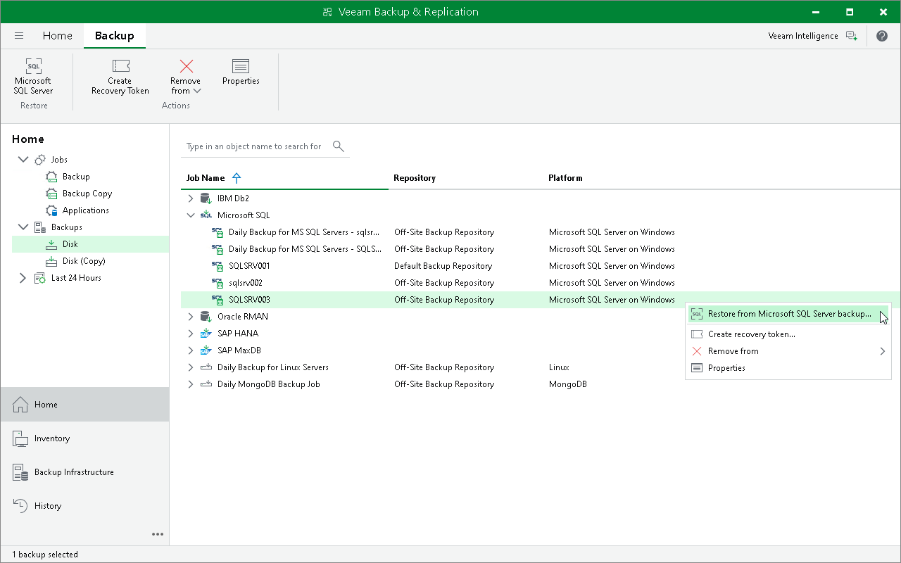
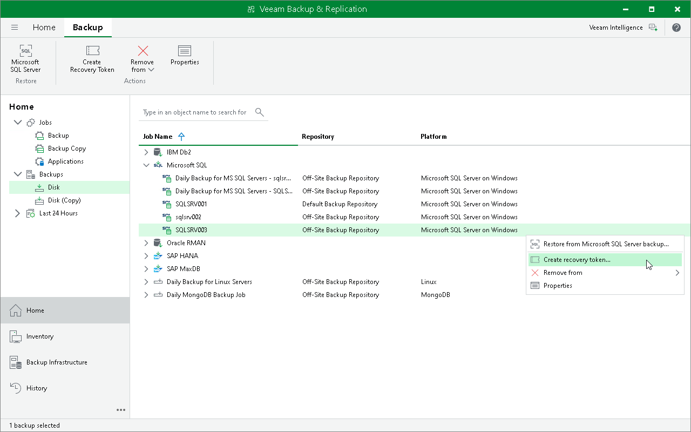
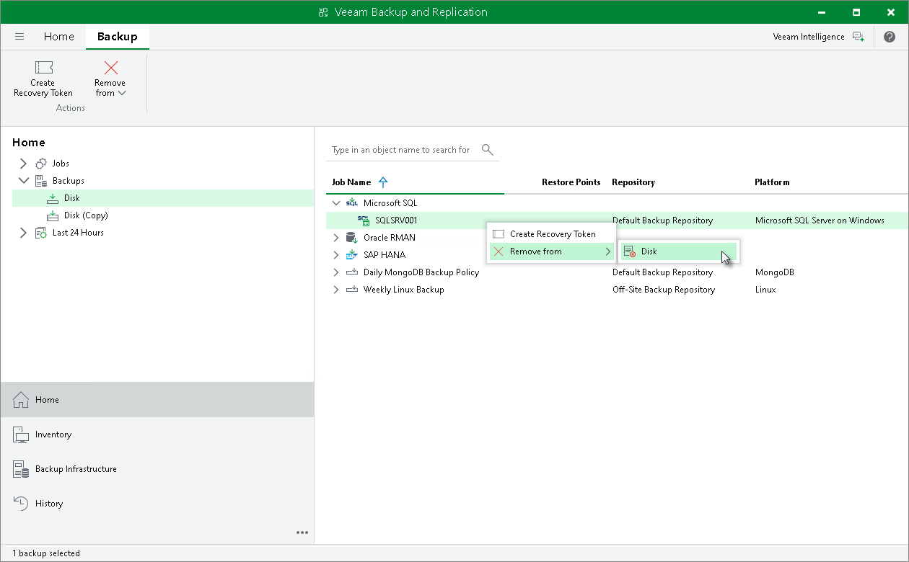
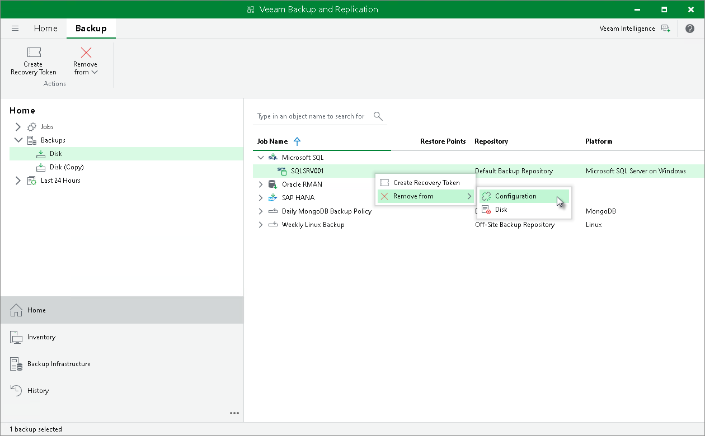
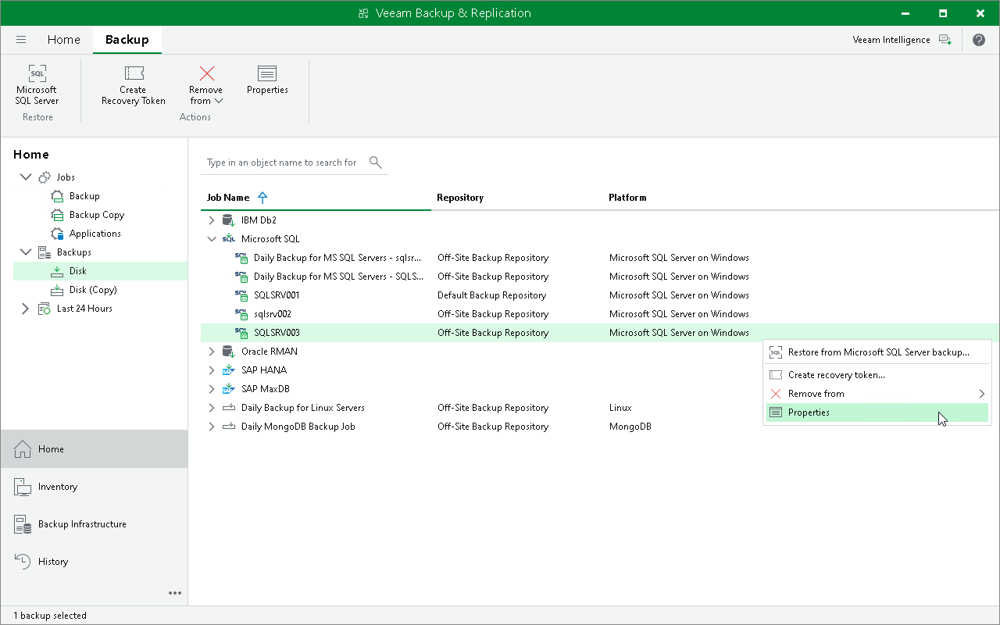

# Managing Veeam Plug-In Backups in Veeam Backup & Replication

|  |
| --- |
| Tip |
| If you want to manage backups created by Veeam Plug-In operating in the managed mode, see [Managing Application Backups](application_backups.md). |

In the Veeam Backup & Replication console, backups created by Veeam Plug-Ins are displayed in the Backups node of the Home view. In the working area, backups created by Veeam Plug-In for Microsoft SQL Server are listed under the Microsoft SQL node.

For backups created by Veeam Plug-In for Microsoft SQL Server, consider the following:

* In the working area, backups created by Microsoft SQL Server are listed under the Microsoft SQL node.
* In the list of Microsoft SQL Server backups, Veeam Backup & Replication displays one backup for a standalone Microsoft SQL Server, Microsoft SQL Server failover cluster or Always On availability group. This backup contains all restore points created for different databases that reside on this server, cluster or availability group.

* Veeam Backup & Replication generates names for Microsoft SQL Server backups according to the following rules:

* For standalone Microsoft SQL Server, Veeam Backup & Replication generates the backup name based on name of Microsoft SQL Server.
* For Microsoft SQL Server that operates as part of a failover cluster or availability group, Veeam Backup & Replication generates the backup name based on the name of the cluster or name of the availability group.

You can use the Veeam Backup & Replication console to restore using Veeam Explorer for Microsoft SQL Server, create recovery token, delete the backup, and view the backup properties.

Restoring with Veeam Explorer for Microsoft SQL Server

You can restore Microsoft SQL Server databases from Veeam Plug-In backups in the Veeam Backup & Replication console. To restore Microsoft SQL Server databases Veeam Backup & Replication uses Veeam Explorer for Microsoft SQL Server. For details, see [Veeam Explorer for Microsoft SQL Server](https://helpcenter.veeam.com/docs/vbr/userguide/vesql_user_guide.html?ver=13).

Alternatively, you can use Veeam Explorer cmdlets to perform restore from Microsoft SQL Server databases. For details, see the [Veeam Explorer for Microsoft SQL Server](https://helpcenter.veeam.com/docs/vbr/explorers_powershell/veeam_explorer_for_microsoft_sql.html?ver=13) section of the Veeam Explorers PowerShell Reference.

Creating Recovery Token

If you want to recover a database from a specific backup, you can use the Create recovery token operation.

You can generate a recovery token on the Veeam Backup & Replication side. Then, on the Microsoft SQL Server side, use this token to get access to the backup and recover the database stored in it. To learn more about operations on the Microsoft SQL Server side, see [Restore to Another Server](mssql_db_restore_another_server.md#token).

Before creating a recovery token, consider the following prerequisites and limitations:

* Recovery tokens stay valid for 24 hours.
* You can recover data only from the backup for which the recovery token is generated.
* During recovery, Veeam Backup & Replication does not stop backup operations.
* You cannot create a recovery token for a whole backup copy job, but you can create a recovery token for individual objects included in a backup copy job.

To create a recovery token on the Veeam Backup & Replication side:

1. Open the Home view.
2. In the inventory pane, click Backups.
3. In the working area, right-click the backup and select Create recovery token.

You can create a recovery token for several backups. To do this, press and hold [Ctrl], select multiple backups, right-click one of the selected backups and select Create recovery token.

1. In the Create Recovery Token window, click Create.

|  |
| --- |
| Tip |
| Alternatively, you can create and modify the existing recovery token using the PowerShell console. To learn more, see the [Working with Tokens](https://helpcenter.veeam.com/docs/vbr/powershell/tokens.html?ver=13) section in the Veeam PowerShell Reference. |

Deleting Backups Manually

You can use the Veeam Backup & Replication console to delete backups created with Veeam Plug-In for Microsoft SQL Server from a Veeam backup repository.

To delete a backup, do the following:

1. In the Veeam Backup & Replication console, open the Home view.
2. In the inventory pane, select Backups.
3. In the working area, right-click the name of the backed-up object and select Remove from > Disk.

Removing Backups from Configuration

If you want to remove records about backups from the Veeam Backup & Replication console and configuration database, you can use the remove from configuration operation.

When you remove a backup from configuration, backup files (.VAB, .VASM, .VACM) remain in the backup repository. You can import the backup later and restore data from it.

To remove a backup from configuration:

1. Open the Home view.
2. In the inventory pane, select Backups.
3. In the working area, select the necessary backup.
4. Press and hold the [Ctrl] key, right-click the backup and select Remove from > Configuration.

Viewing Backup Properties

To review what data Veeam Plug-In has backed up, check the backup properties in the Veeam Backup & Replication console.

To view backup properties:

1. Open the Home view.
2. In the inventory pane, expand the Backups node and select Disk. To view properties of backups stored on tape, select Tape.
3. In the working area, right-click the backup and select Properties.

The backup properties window displays the following information about the content of a backup file:

* Objects — servers and databases backed up by Veeam Plug-In.
* Restore Points — points in time to which you can restore the backed-up databases. The information is stored in the Veeam Backup & Replication configuration database.
* Files — backup files of a selected database that are stored in the backup repository.

To find a specific item in a list, use the search field. To copy the path to a backup file, use the Copy path button.

Page updated 2026-07-29

