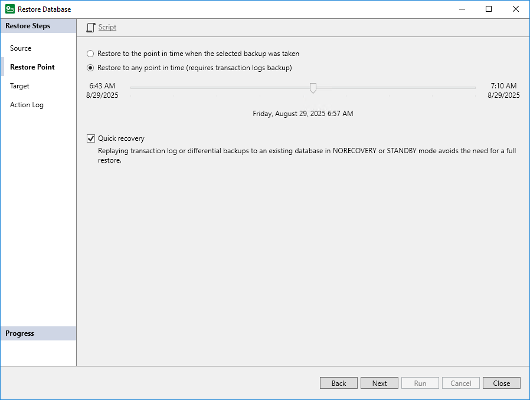

# Step 3. Specify Point in Time

At the Restore Point step of the wizard, select a point in time and a way that Veeam Plug-In will restore data:

1. Select a point in time to which you want to restore the database:

* Select Restore to the point in time when the selected backup was taken if you want to restore the database to the point in time when the restore point that you selected at the Source step was created.
* Select Restore to any point in time if you want to restore the database to a specific point in time between the selected restore point and a previous restore point. This option is available if you restore data from a backup that contains Microsoft SQL Server transaction logs.

Use the slider control to choose the point in time you need.

1. Select Quick recovery if you want Veeam Plug-In to apply differential and log backup to the existing database. Otherwise, Veeam Plug-In will restore an entire database and then applies differential or log backup to the restored database.

When using the Quick recovery option, consider the following:

* Quick recovery is available if you restore data from a backup file that contains differential or log backup. Veeam Plug-In functions differently depending on the backups that are available in your repository:

* If the backup file contains differential and log backups, Veeam Plug-In analyzes existing backups, creates a restore chain with the least possible number of differential and log backups and applies these backups to the existing database.
* If the backup file contains only log backups, Veeam Plug-In applies log backups to the existing database.

* Quick recovery is available if the target database recovery state is NORECOVERY or STANDBY.

|  |
| --- |
| Tip |
| The Quick recovery option may be helpful, for example, if you plan to continuously restore database to another location and want to have as relevant as possible copy of the backed-up database. |

