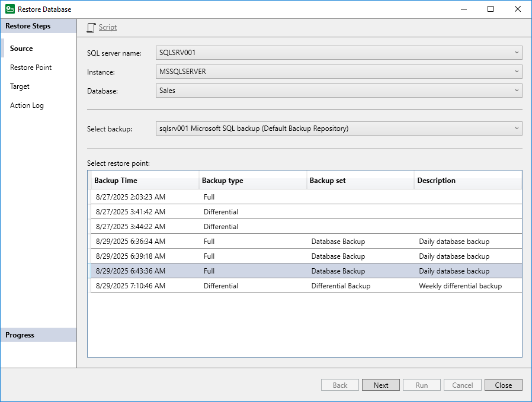

# Step 2. Select Database to Restore

At the Source step of the wizard, select a Microsoft SQL Server database that you want to restore and restore point from which you want to restore the database:

1. From the SQL Server Name drop-down list, select the name of the machine that runs Microsoft SQL Server.
2. From the Instance drop-down list, select the SQL instance whose database you want to restore.
3. From the Databases drop-down list, select the database that you want to restore.
4. From the Select backup drop-down list, select the name of the backup that contains the selected database. If only one backup in the backup repository contains the selected database, Veeam Plug-In will automatically select and display this backup.
5. From the Select restore point list, select the name of the restore point from which you want to recover data.

