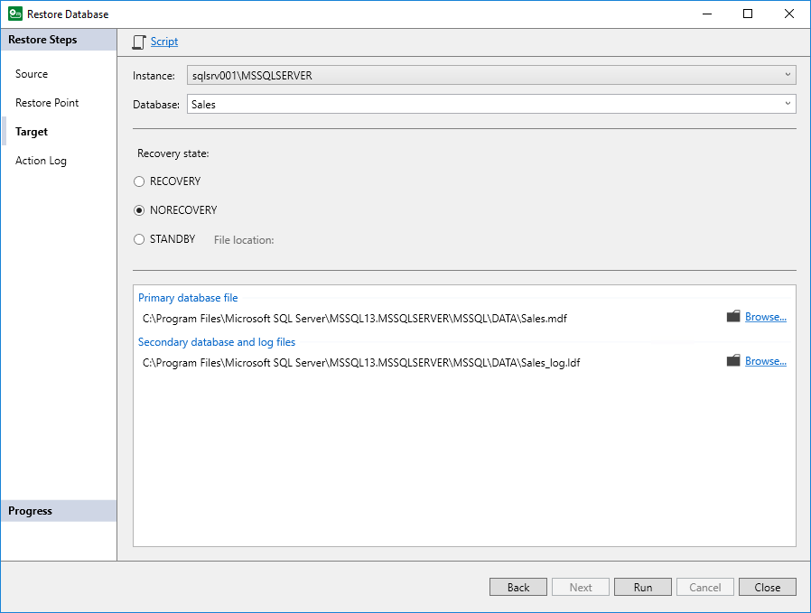

# Step 4. Specify Restore Target

In this article

At the Target step of the wizard, specify where and how you want to restore the database:

1. From the Instance drop-down list, select the SQL instance where you want to restore the database.
2. In the Database field, specify the name for the restored database or select the name of the target database from the drop-down list. Keep in mind that if you restore a database from the backup to a database that exists in the SQL instance, the target database will be overwritten.
3. In the Recovery state section, select the recovery state:

* RECOVERY

Rolls back (undo) any uncommitted changes.

* NORECOVERY

Skips the undo phase so that uncommitted or incomplete transactions are held open.

This allows further restore stages to carry on from the restore point. When applying this option, the database will be in the norecovery state and inaccessible to users.

* STANDBY

The database will be in the standby state and therefore available for read operations. You can also provide a standby file with uncommitted transactions.

For more information on recovery modes, see [this Microsoft article](https://msdn.microsoft.com/en-us/library/ms191455.aspx).

1. Review the following file locations:

* Primary database file
* Secondary database file and log files

By default, Veeam Plug-In selects the same file locations as for the original database. To specify custom file locations, do the following:

1. Click Browse next to the necessary database file type.
2. In the Browse For Folder window, browse to the folder where you want to create the restored database files or click Make New Folder to create a new folder, and click OK.

1. Click Run to start the restore process.

Page updated 11/28/2025

Page content applies to build 13.0.1.1071
