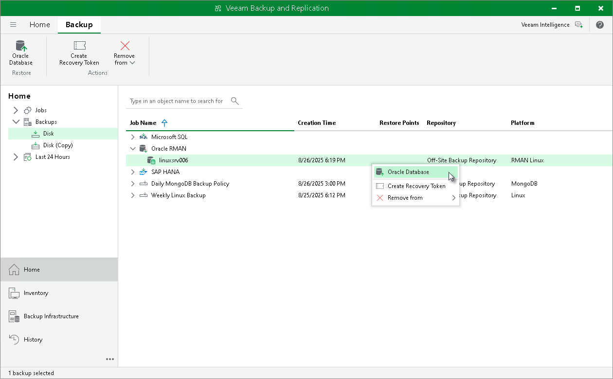

# Restore with Veeam Explorer for Microsoft SQL Server

In this article

You can restore Microsoft SQL Server databases from Veeam Plug-In backups in the Veeam Backup & Replication console. To restore Microsoft SQL Server databases Veeam Backup & Replication uses Veeam Explorer for Microsoft SQL Server. For details, see [Veeam Explorer for Microsoft SQL Server](https://helpcenter.veeam.com/docs/vbr/userguide/vesql_user_guide.html?ver=13).

Alternatively, you can use Veeam Explorer cmdlets to perform restore from Microsoft SQL Server databases. For details, see the [Veeam Explorer for Microsoft SQL Server](https://helpcenter.veeam.com/docs/vbr/explorers_powershell/veeam_explorer_for_microsoft_sql.html?ver=13) section of the Veeam Explorers PowerShell Reference.

Page updated 11/6/2025

Page content applies to build 13.0.1.1071
