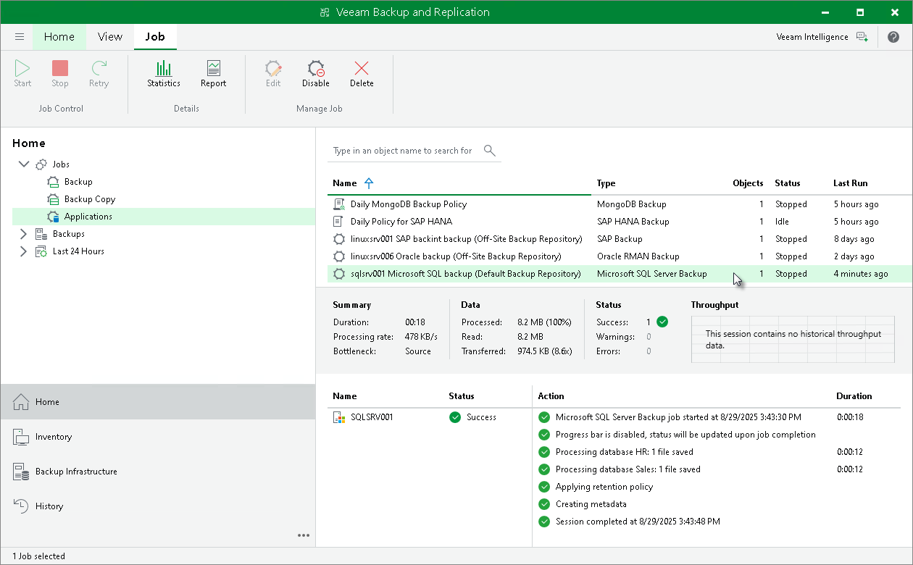
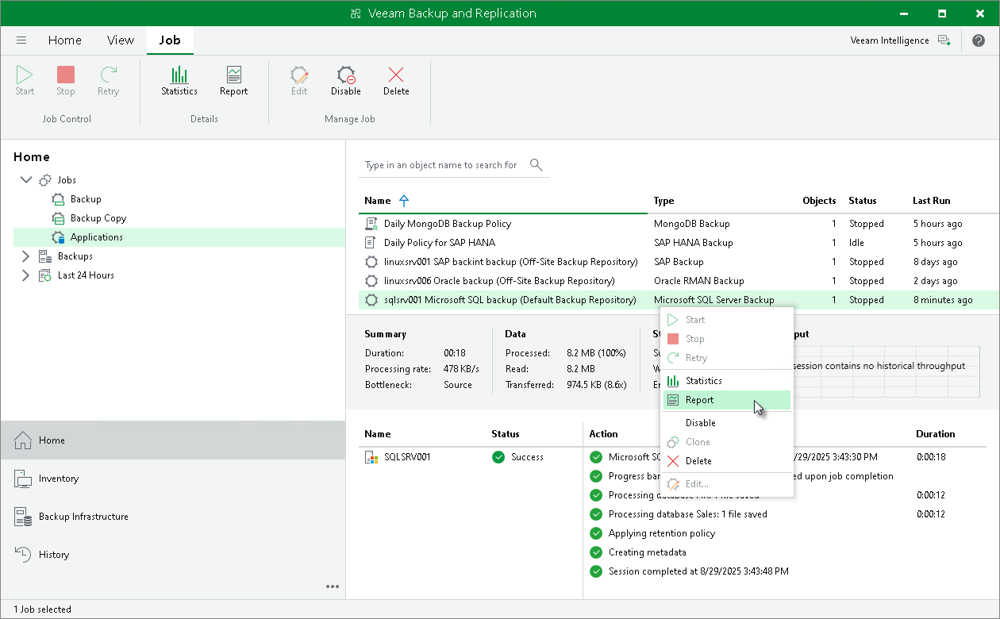
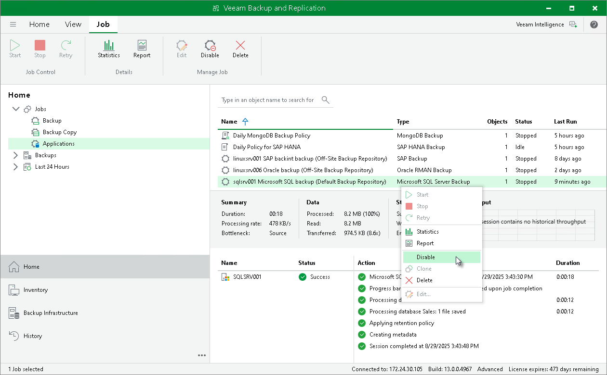

# Managing Backup Job in Veeam Backup & Replication

In this article

After Veeam Plug-In for Microsoft SQL Server starts the backup process, Veeam Backup & Replication creates the backup job. You can use this job to view statistics on the backup process and generate backup job reports. You can also disable the backup job.

You cannot start or edit Microsoft SQL Server backup jobs in the Veeam Backup & Replication console. You can manage backup operations on Microsoft SQL Server only.

Consider the following:

* Veeam Backup & Replication creates one backup job for a standalone Microsoft SQL Server, Microsoft SQL Server failover cluster or Always On availability group. All backup sessions for different databases that reside on this server, cluster or availability group run within this backup job.
* Veeam Backup & Replication generates names for Microsoft SQL Server backup jobs according to the following rules:

* For standalone Microsoft SQL Server, Veeam Backup & Replication generates the backup job name based on the names of Microsoft SQL Server and backup repository where Veeam Plug-In creates Microsoft SQL Server backups.
* For Microsoft SQL Server that operates as part of a failover cluster or availability group, Veeam Backup & Replication generates the backup job name based on the name of the cluster or name of the availability group.

Viewing Backup Job Statistics

To view details of the backup process, do the following:

1. Open the Veeam Backup & Replication console.
2. In the Home view, expand the Jobs node in the inventory pane and click Applications.
3. In the working area, select the application backup policy for Microsoft SQL Server to see details of the current backup process or the last backup job session.

|  |
| --- |
| Note |
| Veeam Backup & Replication does not display the progress bar for a running Veeam Plug-In for Microsoft SQL Server backup job. Statistics for backup jobs of this type becomes available after the backup job session is completed. |

Generating Backup Job Reports

Veeam Backup & Replication can generate reports with details about Microsoft SQL Server backup job session performance. The session report contains the following session statistics: session duration details, details of the session performance, amount of read, processed and transferred data, backup size, compression ratio, list of warnings and errors (if any).

To generate a report, do the following:

1. Open the Veeam Backup & Replication console.
2. In the Home view, expand the Jobs node in the inventory pane and click Applications.
3. In the working area, select the necessary job and click Report on the ribbon. You can also right-click the job and select Report.

Disabling Backup Job

You can disable Microsoft SQL Server backup jobs in the Veeam Backup & Replication console. If you disable the job, you will not be able to run Veeam Plug-In backup commands on Microsoft SQL Server.

To disable a backup job, do the following:

1. Open the Veeam Backup & Replication console.

1. In the Home view, expand the Jobs node in the inventory pane and click Applications.

1. In the working area, select the necessary job and click Disable on the ribbon. You can also right-click the job and select Disable.

Page updated 11/28/2025

Page content applies to build 13.0.1.1071
