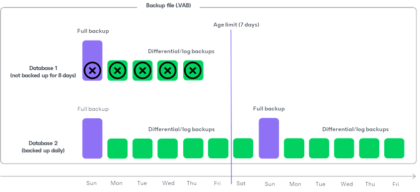

# Force Delete Operation

Besides retention policy, Veeam Plug-In allows you to delete backups of specific databases in the application backup file. This feature uses the age of backups to determine which database backups to delete. It may be helpful, for example, if a database was renamed and backups for this database created before the renaming are no longer processed by Veeam Plug-In.

Considerations and Limitations

Before you delete database backups, consider the following:

* Use the force delete operation with caution, as it may lead to data loss. For example, the force delete operation can remove backups earlier than it is intended according to the retention policy.
* Make sure the number of days specified in the command exceeds the immutability period configured for the backup repository. Otherwise, the command will not be able to delete immutable backups.
* If backups that you want to delete are stored in the scale-out repository:

* Make sure these backups are not on the extent that is in maintenance mode. For details, see [Maintenance Mode](sobr_maintenance.md).
* Make sure backups are not stored in the Archive tier.

* The command cannot delete imported backups.

How Force Delete Operation Works

When running the force delete operation, Veeam Plug-In checks all associated backups (full, differential and log) for each database in the backup file (.VAB). If at least one backup is newer than the specified number of days, Veeam Plug-In retains all backups for that database. If all backups are older than the specified number of days, it deletes all database backups.

The main difference between the retention policy and the force delete operation is that the force delete operation can delete backups for specific databases and keep all other database backups in the backup file (.VAB). For example, a backup file (.VAB) contains backups for 2 databases. One of the databases becomes obsolete, so you stopped backing it up 8 days ago. The second database is active and you back up it daily. Now you want to delete all backups of the obsolete database. In this case you can run the force delete operation with an age limit of 7 days. During the force delete operation, Veeam Plug-In deletes only backups of the first database that was backed up 8 days ago and keeps backups of the second database.

Related Task

[Force Deleting Backups](plugins_mssql_retention_force.md)

