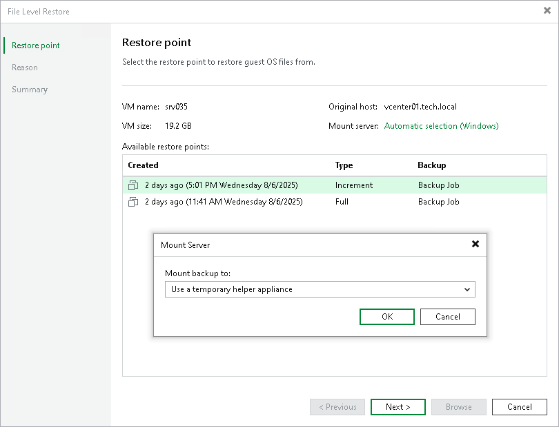

# Step 4. Specify Mount Server

In this article

At the Restore Point step of the wizard, you can select a server that will be used to mount disks of a workload from the backup or replica. You can also choose to configure a new helper appliance where Veeam Backup & Replication will mount workload disks.

|  |
| --- |
| Note |
| Consider the following:   * We recommend leaving the automatically selected mount server. For more information on the selected mount servers, see [Mount Server Automatic Selection](guest_restore_scenarios.md). * [For Linux-based and Unix-based workloads] After the first recovery, Veeam Backup & Replication remembers the selected mount server for workloads of the same platform as the recovered one. Veeam Backup & Replication selects this mount server by default for future recoveries. In the UI, the mount server will be visible under Manual selection. |

To specify a mount server, do the following:

1. At the Restore Point step of the wizard, click the link next to the Mount server field.
2. In the Mount Server window, select one of the following options from the drop-down list:

* <Linux\_host\_name> (original host) — to specify the original Linux server as the mount server. This option is available only for Linux-based workloads.
* Use a temporary helper appliance — to use a temporary helper appliance. If you select this option, the wizard will include a step for configuring the helper appliance.
* Specify a different Linux host — to specify a Linux server that is not added to the Veeam Backup & Replication infrastructure.
* <Mount\_server\_host\_name> — to specify a Microsoft Windows-based or Linux-based mount server. This can be the default mount server or a mount server associated with a repository.
* <Linux\_host\_name> — to specify a Linux server that is added to the backup infrastructure.
* <Host\_name> (Automatic selection) — to specify the mount host selected automatically according to the [mount server automatic selection](guest_restore_scenarios.md) algorithm.

1. [Optional; for <Linux\_host\_name> (original host) option] In the Host credentials window, specify credentials for the original Linux server.
2. [For Specify a different Linux host option] In the Target Server window, specify the host name and connection settings:

1. In the Host name field, specify the IPv4 or IPv6 address or the host name of the Linux server that will be used as a mount server. Note that you can use IPv6 addresses only if IPv6 communication is enabled as described in [IPv6 Support](ipv6.md).
2. From the Credentials list, select an account that will be used to connect to the mount server.

If you have not added the account before, click the Add button on the right of the Credentials list and follow the instructions described in section [Linux Accounts](credentials_manager_linux_console.md).

1. If you want to change the default SSH settings, click Advanced and configure SSH settings as described in section [Specify Credentials and SSH Settings](linux_server_ssh.md#network).
2. Click OK to save the mount server settings.

Page updated 11/19/2025

Page content applies to build 13.0.1.1071
