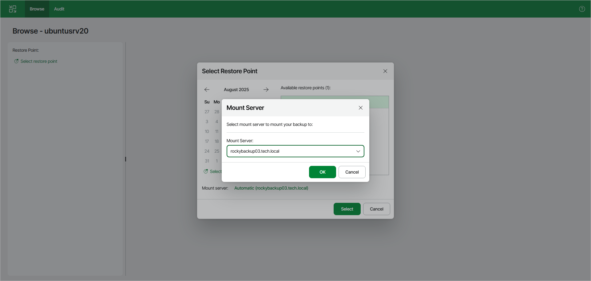

# Step 3. Select Mount Server

In this article

Veeam Backup & Replication chooses a mount server according to the principles described in [Mount Server Automatic Selection](guest_restore_scenarios.md). If you want to select another mount server, click Automatic near the Mount server field. In the Mount Server window, select the required mount server. In the list, you can see mount servers, Linux servers added to the backup infrastructure and the original Linux server in case of recovering files from Linux.

|  |
| --- |
| Note |
| We recommend leaving the automatically selected mount server. For more information on the selected mount servers, see [Mount Server Automatic Selection](guest_restore_scenarios.md). |

Page updated 11/19/2025

Page content applies to build 13.0.1.1071
