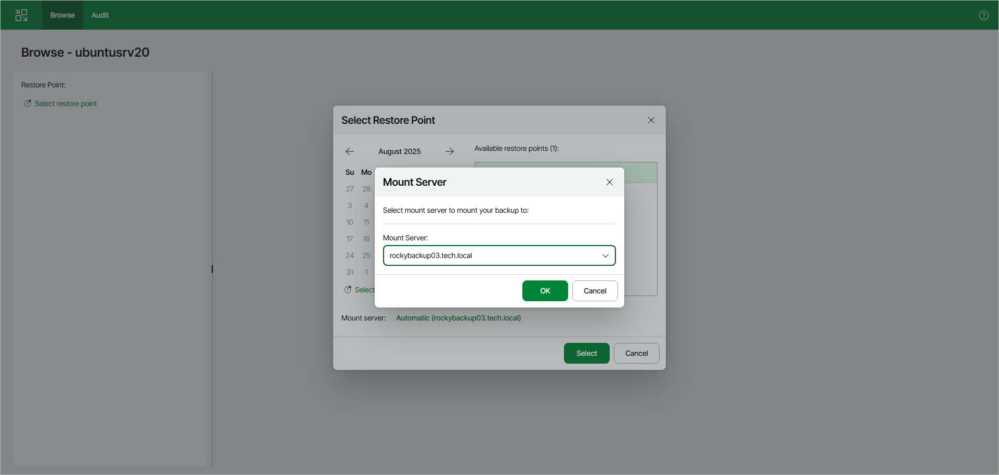

# Step 3. Select Mount Server

Veeam Backup & Replication chooses a mount server according to the principles described in [Mount Server Automatic Selection](guest_restore_scenarios.md). If you want to select another mount server, click Automatic near the Mount server field. In the Mount Server window, select the required mount server. In the list, you can see mount servers, Linux servers added to the backup infrastructure and the original Linux server in case of recovering files from Linux.

|  |
| --- |
| Note |
| Consider the following:   * We recommend leaving the automatically selected mount server. For more information on the selected mount servers, see [Mount Server Automatic Selection](guest_restore_scenarios.md). * For Microsoft Hyper-V backups, if the source VM was powered off at the backup time, Veeam Backup & Replication cannot retrieve the guest OS information. Veeam Backup & Replication treats the guest OS as Linux and selects a Linux-based mount server by default. If the VM runs Microsoft Windows, select the Windows mount server manually. |

