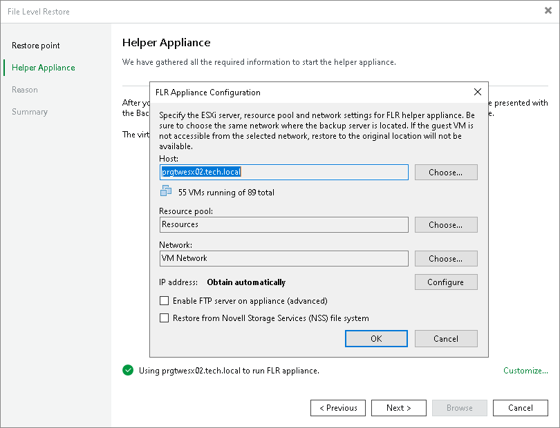

# Step 5. Specify Location for Helper Appliance

The Helper Appliance step of the wizard is available only if you have selected the Use a temporary helper appliance option at the [Restore Point](multios_restore_host_vm.md) step.

At this step of the wizard, you specify a host to which you want to place the helper appliance. To select a destination for the helper appliance:

1. At the bottom of the window, click Customize.
2. In the Host field, specify the host on which the helper appliance must be registered.
3. [For VMware vSphere] In the Resource pool field, specify a resource pool to which the helper appliance must be placed.

|  |
| --- |
| Note |
| If you perform recovery from storage snapshots, the Host and Resource pool fields cannot be changed. Their values are taken from the [Configure Staging Host](guest_restore_storage_location.md) step of the wizard. |

1. Select a network for the helper appliance:

1. On the right of the Network field, click Choose.

In the Select Network window, Veeam Backup & Replication will display a list of networks to which the specified host is connected.

1. From the Networks list, select a network to which the helper appliance must be connected and click OK.

Consider that the backup server and the mount server must have access to the helper appliance over the network.

1. [For Microsoft Hyper-V] If you use VLAN IDs, in the VLAN ID field specify the correct VLAN ID of the network where the helper appliance must reside.
2. Specify IP addressing settings for the helper appliance and DNS server:

1. Click Configure.
2. Switch to the IPv4 or IPv6 tab depending on which addresses you want to configure. Note that you can use IPv6 addresses only if IPv6 communication is enabled as described in section [IPv6 Support](ipv6.md).
3. Configure IP settings for the helper appliance:

* If you use a DHCP server in the network and want to obtain the IP address automatically, leave the Obtain an IP address automatically option selected.

* To manually assign a specific IP address to the helper appliance, click Use the following IP address and specify the IP address settings.

1. Configure IP settings for the DNS server:

* If you use a DHCP server in the network and want to obtain the IP address automatically, leave the Obtain DNS server address automatically option selected.

* To manually assign a specific IP address to the DNS server, click Use the following DNS server address and specify preferred and alternate addresses.

1. Click OK.

1. To enable FTP access to the recovered file system, select the Enable FTP server on appliance (advanced) check box. As a result, users will be able to access the helper appliance over FTP, browse the file system of the recovered workload and download necessary files on their own.
2. [For VMware vSphere] If you are performing recovery of a VM with the Novell Storage Services file system, select the Restore from Novell Storage Services (NSS) file system check box. Veeam Backup & Replication will deploy a specific appliance that supports the Novell Storage Services file system.

|  |
| --- |
| Important |
| [For VMware vSphere] Consider the following:   * When choosing an ESXi host for the helper appliance used for file-level recovery from the Novell Storage Services file system, make sure that it allows running VMs with 64-bit guest OSes. * If you recover files from a non-NSS file system, check that the Restore from Novell Storage Services (NSS) file system check box is not selected. Otherwise, the recovery process may work incorrectly. |

