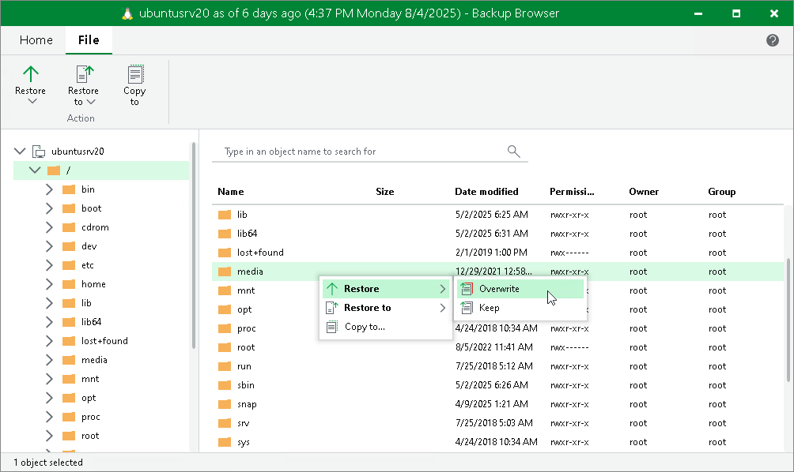
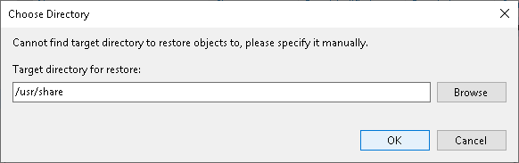
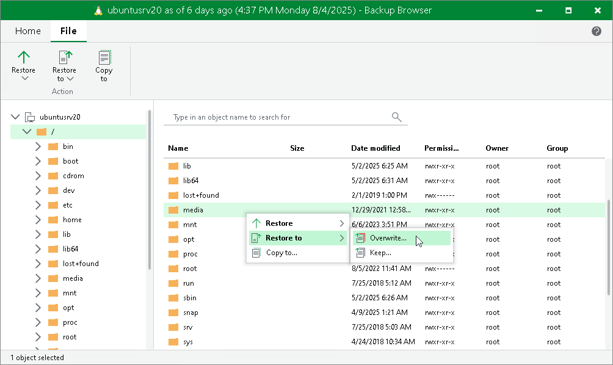
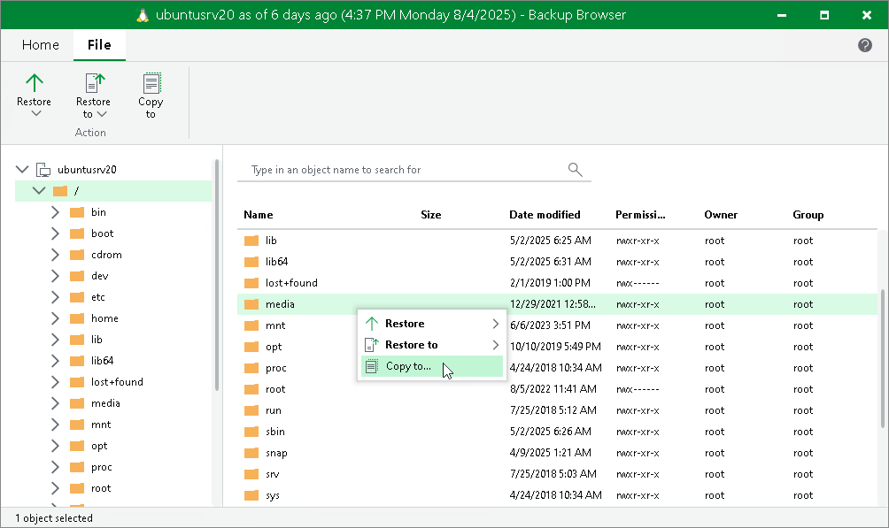
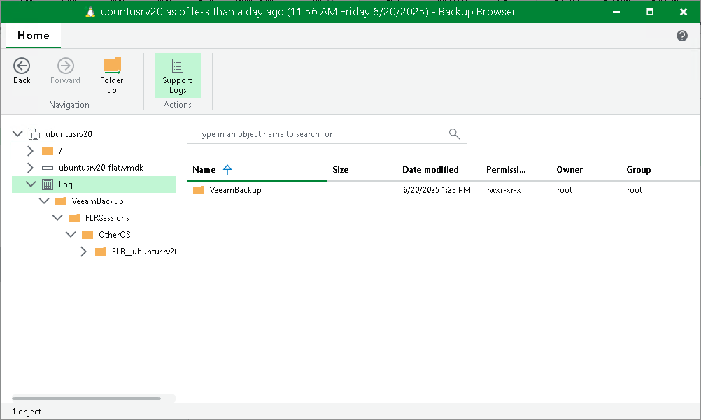

# Linux Specific Operations

In this article

After the wizard is closed, Veeam Backup & Replication opens the Veeam Backup browser displaying the file system tree of the restored VM.

In the Veeam Backup browser, you can perform the following operations:

* [Restore files to the original location](#original) (the Restore command)
* [[For VMware vSphere, Cloud Director, Hyper-V, Veeam Agent for Linux, Veeam Agent for IBM AIX or Veeam Agent for Oracle Solaris] Restore files to a new location](#restore_to) (the Restore to command)
* [Restore files to a new location over the network](#new) (the Copy to command)
* [Access files over FTP](#ftp)
* [Access helper appliance logs](#logs)

|  |
| --- |
| Note |
| You can browse the VM guest OS files and access restored files on the FTP only while the Veeam Backup browser with the restored files is open. After the Veeam Backup browser is closed, Veeam Backup & Replication unmounts the VM disks from the helper appliance and removes the helper appliance from the host. |

Restoring Files to Original Location

To restore files and folders to the original location, do the following:

1. Select the necessary files and folders in the file system tree or in the details pane on the right.
2. Right-click one of the selected items and select one of the following:

* To overwrite the original files and folders with the ones restored from the backup, select Restore > Overwrite.
* To save the restored files and folders next to the original ones, select Restore > Keep.

Veeam Backup & Replication will add the RESTORED\_YYYYMMDD\_HHMMSS postfix to the original names and store the restored items in the same folder where the original items reside.

Alternatively, you can select the same commands on the ribbon.

[For Hyper-V] If you restore files from disks that were not mounted to the file system, Veeam Backup & Replication asks for a target directory where to restore the selected files. In this case, file restore to the original location is not possible.

To restore files to the original location, Veeam Backup & Replication can use the following:

* The account for VM guest OS access specified in the backup job settings.
* The account specified for the original server used as the helper host.
* The credentials specified in the Protection Group.

If the account does not have sufficient rights to access the target VM, you will be prompted to enter credentials. In the Credentials window, specify a user account to access the destination location (server or shared folder).

In some cases, you may remove the original VM and restore it from the backup by the time of guest OS file restore. If you then attempt to restore VM guest OS files to the original location, Veeam Backup & Replication will not be able to find the original VM by its reference ID, and will display a warning. Click OK and browse to the target VM in the virtual infrastructure to which you want to restore VM guest OS files.

Restoring Files and Folders to New Location

You can restore files and folders to a new machine of the same platform over the network or without the network. This functionality is available for the following types of backups:

* Backups of VMware vSphere VMs.
* Backups of VMware Cloud Director VMs created by Veeam Backup & Replication.
* Backups of Microsoft Hyper-V VMs created by Veeam Backup & Replication.
* Backups created by Veeam Agent for Linux, Veeam Agent for IBM AIX or Veeam Agent for Oracle Solaris.

To restore files and folders to a new location over the network or without the network, do the following:

1. Select the necessary files and folders in the file system tree or in the details pane on the right.
2. Right-click one of the selected items and select one of the following:

* To overwrite files and folders with identical names in the target location, select Restore to > Overwrite.
* To keep files and folders with identical names in the target location, select Restore to > Keep.

If there are items with identical names, Veeam Backup & Replication will add the RESTORED\_YYYYMMDD\_HHMMSS postfix to the original names and store the restored items in the target location.

Alternatively, you can select the same commands on the ribbon.

1. In the Select Virtual Machine window, select the target workload.
2. In the Credentials window, provide credentials to connect to the target workload.
3. In the Choose Target Folder window, click Browse and select a folder where items will be restored.

Note that the browse option is not available for backups of Hyper-V VMs and backups created by Veeam Agents.

Saving Files to New Location over Network

You can restore files and folders to components of the Veeam Backup & Replication infrastructure available over the network.

To save files and folders to a new location over the network:

1. Select the necessary files and folders in the file system tree or in the details pane on the right.
2. Right-click one of the selected files or folders and select Copy to.
3. In the Select Destination window, select the necessary destination:

+ To recover files to a server already added to the Veeam Backup & Replication infrastructure, select the server from the Server drop-down list and then specify the path to a folder where files will be recovered.
+ To recover files to a Linux server that is not added to the Veeam Backup & Replication infrastructure, select Specify a different host from the Server drop-down list and follow the steps of the [wizard to add a Linux server](add_linux_server.md) that will be used as a target host. The server will be added ad hoc. Then specify the path to a folder where files will be recovered.

The server you add ad hoc will not appear in the list of managed hosts in Veeam Backup & Replication: its purpose is to host the files that you recover. It will only remain visible in the Veeam Backup browser until all currently active file-level restore sessions are completed.

+ To recover files to a shared folder, specify a path to the destination folder in the Path to folder field.

1. If you want to preserve original permissions and ownership for recovered files, select the Preserve permissions and ownership check box in the Select Destination window.
2. If prompted, in the Credentials window, specify the settings of the user account to access the destination location.

Accessing Files over FTP

If you have chosen to enable the FTP server on the helper appliance, the restored file system will also be available over FTP at ftp://<FLR\_appliance\_IP\_address>. Other users in the same network can access the helper appliance to restore the files they need.

Accessing the appliance over FTP requires credentials. Use the Guest OS helper appliance credentials specified in managed credentials. If the password has not been updated, refer to [this Veeam KB article](https://www.veeam.com/kb1447).

Accessing Helper Appliance Logs

If you need to access logs of the helper appliance, click Support Logs on the Veeam Backup browser ribbon. Veeam Backup & Replication will show the Log node under the file system tree. To hide this node, click Support Logs once again.

Page updated 11/19/2025

Page content applies to build 13.0.1.1071
