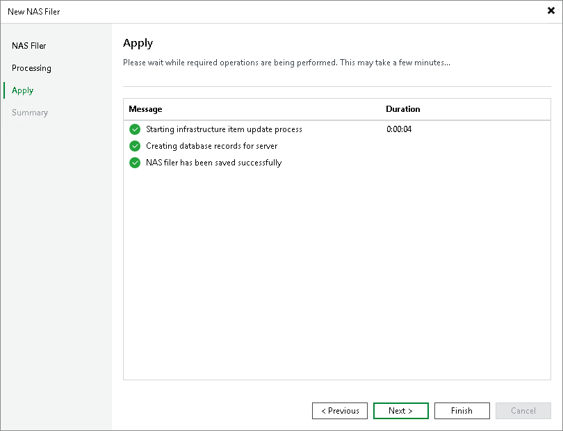

# Step 4. Apply File Share Settings

In this article

At the Apply step of the wizard, wait till Veeam Backup & Replication installs and configures all required components. Click Next to complete the procedure of adding the storage system as a NAS filer.

Page updated 9/3/2025

Page content applies to build 13.0.1.1071
