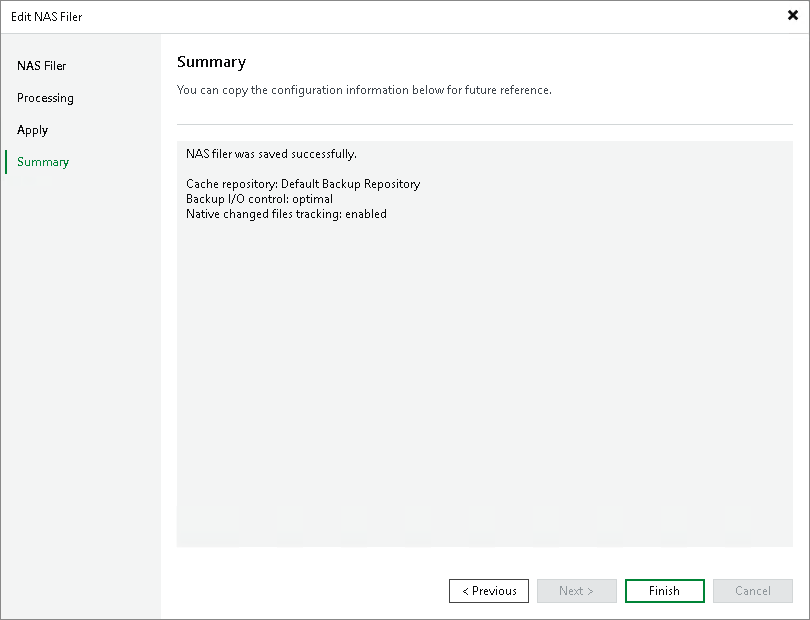

# Step 5. Finish Working with Wizard

In this article

At the Summary step of the wizard, review details of the storage system added as a NAS filer and click Finish to exit the wizard.

Page updated 9/3/2025

Page content applies to build 13.0.1.1071
