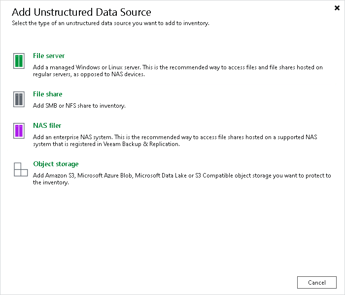

# Step 1. Launch New NAS Filer Wizard

To launch the New NAS Filer wizard:

1. Open the Inventory view.
2. Do one of the following:

* In the inventory pane, right-click the Unstructured Data node and select Add unstructured data source.
* Select the Unstructured Data node and click Add Data Source on the ribbon.
* Select the Unstructured Data node and click Add Data Source in the working area.

1. In the Add Unstructured Data Source window, click NAS filer.

