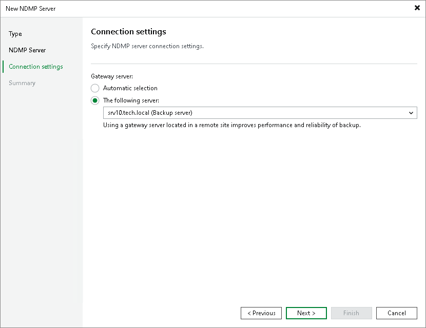

# Step 4. Specify Connection Settings

At the Connection Settings step of the wizard, specify settings for the gateway server:

* If a network connection between the NDMP server and gateway server is fast, choose Automatic selection. In this case, Veeam Backup & Replication will automatically select a gateway server.
* If you perform backup over WAN or slow connections, choose The following server. From the list below, select a Microsoft Windows server or a Linux server on the target site that you want to use as a gateway server. The selected server must have a direct access to the NDMP server and must be located as close to the NDMP server as possible.

Page updated 2026-07-01

