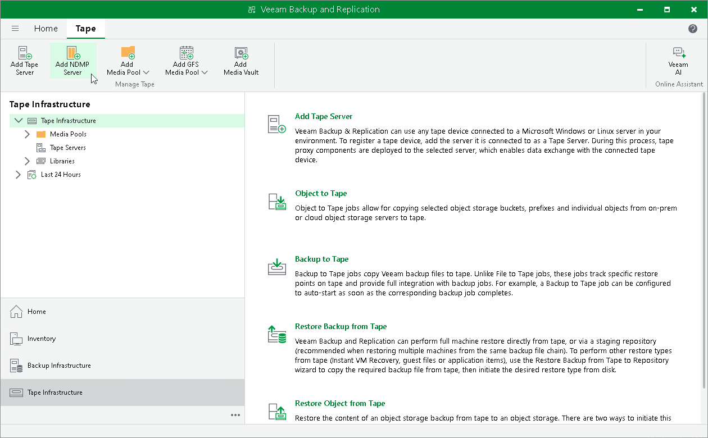

# Step 1. Launch New NDMP Server Wizard

In this article

To launch the New NDMP Server wizard:

1. Open the Tape Infrastructure view.
2. In the inventory pane, select the Tape Infrastructure node and click Add NDMP Server on the ribbon.

Page updated 6/25/2025

Page content applies to build 13.0.1.1071
