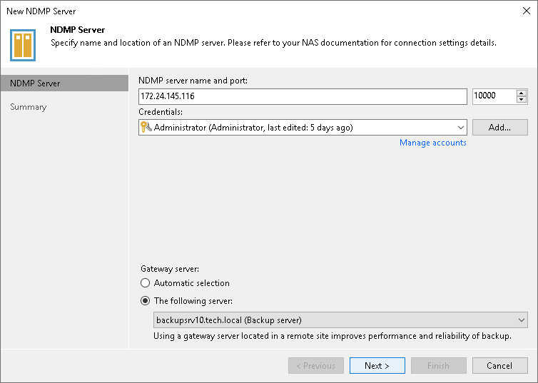

# Step 2. Specify NDMP Server Name and Location

In this article

At the NDMP Server step of the wizard, enter the name of the NDMP server and connection details.

1. In the NDMP server name and port field, enter the name or the IPv4 or IPv6 address of the NDMP server you want to connect to and the port for the connection. Note that you can use IPv6 addresses only if IPv6 communication is enabled as described in the [IPv6 Support](ipv6.md) section. Check your NAS device settings for details.
2. From the Credentials list, select credentials for the account that has administrator privileges on the NDMP server. If you have not set up credentials beforehand, click the Manage accounts link or click Add on the right to add the credentials. For more information, see [Credentials Manager](credentials_manager.md).

Veeam Backup & Replication will use the provided credentials to deploy its components on the added server.

1. In the Gateway server section, specify settings for the gateway server:

* If a network connection between the NDMP server and gateway server is fast, choose Automatic selection. In this case, Veeam Backup & Replication will automatically select a gateway server.
* If you perform backup over WAN or slow connections, choose The following server. From the list below, select a Microsoft Windows server or a Linux server on the target site that you want to use as a gateway server. The selected server must have a direct access to the NDMP server and must be located as close to the NDMP server as possible.

Page updated 8/6/2025

Page content applies to build 13.0.1.1071
