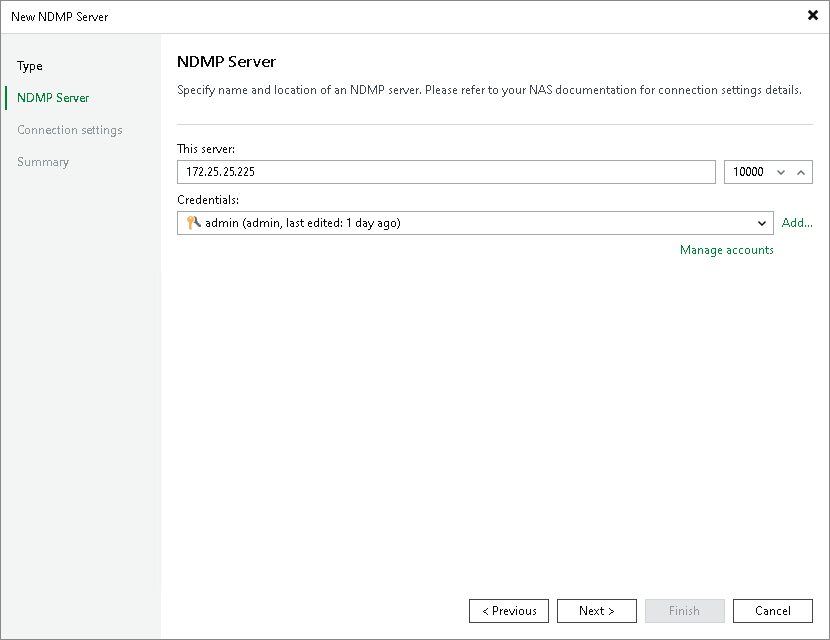

# NDMP Server Name and Credentials for Standalone NDMP Server

At the NDMP Server step of the wizard, specify the name of the NDMP server and credentials.

1. In the This server field, enter the DNS name or the IPv4 or IPv6 address of the NDMP server you want to connect to and the port for the connection. Note that you can use IPv6 addresses only if IPv6 communication is enabled as described in the [IPv6 Support](ipv6.md) section. Check your NAS device settings for details.

The default port for connection is 10000.

1. From the Credentials list, select credentials for the account that has administrator privileges on the NDMP server. If you have not set up credentials beforehand, click the Manage accounts link or click Add on the right to add the credentials. For more information, see [Credentials Manager](credentials_manager.md).

Veeam Backup & Replication will use the provided credentials to deploy its components on the added server.

Page updated 2026-07-02

