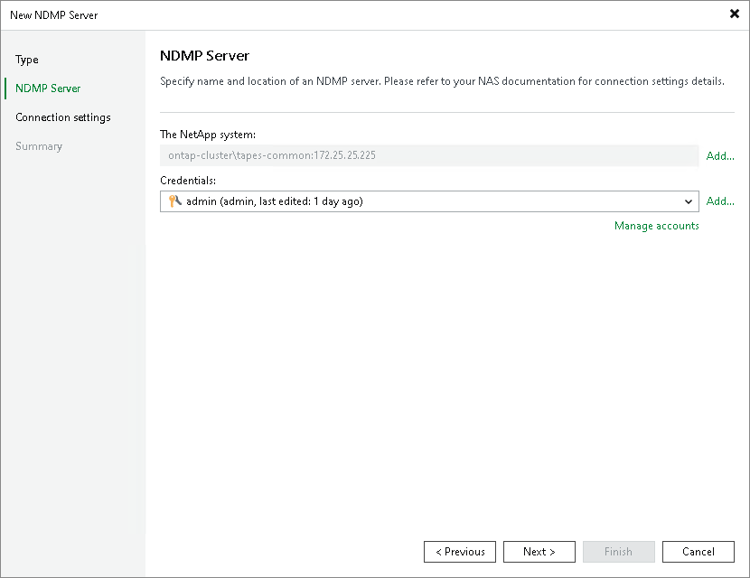

# NDMP Server Name and Credentials for NetApp NDMP Server

At the NDMP Server step of the wizard, specify the name of the NetApp NDMP server and credentials.

1. Click Add on the right of the NetApp system field and select the NDMP-capable data LIF (Logical Interface) in the Add Objects window. Check your NetApp system settings for details.
2. From the Credentials list, select credentials for the account that has administrator privileges on the NetApp NDMP server. If you have not set up credentials beforehand, click the Manage accounts link or click Add on the right to add the credentials. For more information, see [Credentials Manager](credentials_manager.md).

Veeam Backup & Replication will use the provided credentials to deploy its components on the added server.

Page updated 2026-07-01

