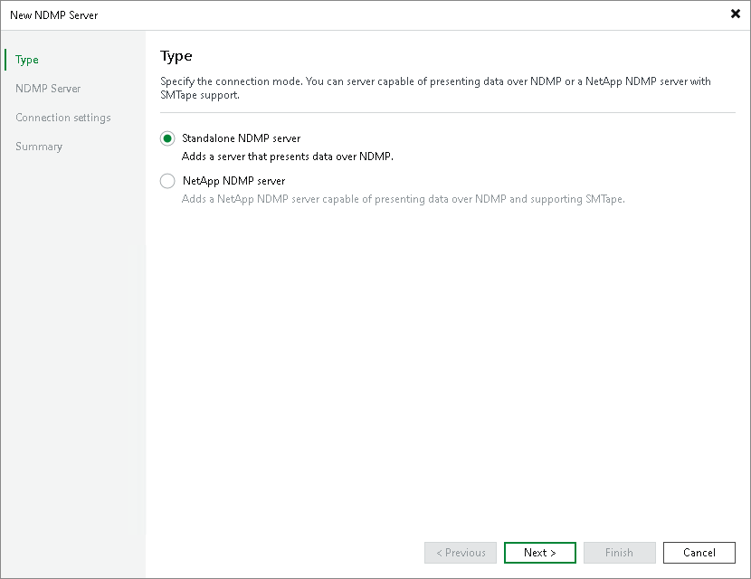

# Step 2. Select Connection Mode

At the Type step of the wizard, specify the connection mode for the server:

* If you want to add a regular NDMP server, choose Standalone NDMP server.
* If you want to add a NetApp NDMP server, choose NetApp NDMP server. In this case, Veeam Backup & Replication will leverage the SMTape functionality to perform volume backups to tape.

Page updated 2026-07-02

