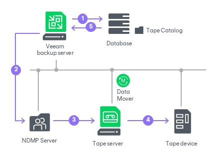

# NDMP Server Backup to Tape

You can back up data from NAS devices to tape using the NDMP protocol. For NetApp storage systems, Veeam Backup & Replication supports the SMTape functionality to back up NetApp data to tape by the NDMP protocol. For both of these scenarios, you need to utilize the file to tape job. For more information about the SMTape support, see [NetApp NDMP Server Backup to Tape](netapp_ndmp.md).

|  |
| --- |
| Note |
| The availability of the NDMP server backup to tape feature depends on the license you use. For more details about licensing support, see [Veeam Data Platform Feature Comparison](https://www.veeam.com/veeam_data_platform_feature_comparison_ds.pdf). |

To back up data from NAS devices by the NDMP protocol, you need to add the device as an NDMP server. For details, see [Adding NDMP Servers](adding_ndmp_servers.md).

|  |
| --- |
| Important |
| Even if the NAS device supporting NDMP protocol is already added to Veeam Backup & Replication as an unstructured data source, you must add the NDMP server as a separate procedure. Otherwise, you will not be able to perform file backup to tape. |

Backup Infrastructure

For file backup to tape jobs for standalone NDMP servers, Veeam Backup & Replication backs up the file system state of entire NDMP volumes. While this type of backup operates at the file level, you can back up or restore only whole NDMP volumes.

During a job run, Veeam Backup & Replication performs the following operations:

1. Veeam Backup & Replication checks the backup chain to determine whether to run a full or an incremental backup.
2. Veeam Backup & Replication instructs the NDMP server to create a dump of the file system state relative to the selected backup level.
3. For incremental backups, Veeam Backup & Replication reads the dump data from the NDMP server through the gateway server to detect if any data has been modified.
4. Veeam Backup & Replication connects to Veeam Data Movers and starts the data transfer process from the source NDMP server through the gateway server to the tape server and the tape drive.

In case the NDMP server has automatic gateway server selection enabled, the tape server is automatically added to the list of available gateway servers for this backup session and is used by default.

1. Veeam Backup & Replication records the backup in the configuration database so that subsequent incremental runs can reference the current backup chain.

|  |
| --- |
| Note |
| For all standalone NDMP servers, the backup chain stored on tapes can consist of 10 restore points maximum. On the 11th run, Veeam Backup & Replication will force an active full. |

Requirements and Limitations for NDMP Servers

The following requirements and limitations apply to all NDMP server backup to tape (both standalone and NetApp NDMP servers):

* The NDMP protocol version 4 or higher is supported.
* Only backup of whole volumes is supported.
* Only in-direct NDMP backup is supported. Veeam Backup & Replication moves the backup data from the NDMP server via the gateway server and tape server directly to the tape drive.

* The NDMP server performs its own backup consistency check for the NDMP volumes. To ensure the correct calculation of the delta of changes and the backup chain integrity, Veeam Backup & Replication does not allow adding one NDMP volume to more than one file to tape job.
* For the NDMP server backup to a media pool with the Process independent data sources simultaneously option enabled, Veeam Backup & Replication processes NDMP volumes in parallel, with each volume written by a separate drive. For more information, see [Tape Parallel Processing](parallel_processing.md).

Limitations for Standalone NDMP Servers

The following limitations apply to standalone NDMP server backup to tape:

* Both the NetApp node-scoped NDMP mode and the NetApp Cluster Aware Backup (CAB) extension of the NDMP protocol are supported:

* In node-scoped configuration, add each cluster node to the backup user interface specifying a data LIF IP/DNS address associated with the node.
* To support backup of NetApp CAB extension, add the NDMP server with IP address of the cluster management interface or with the NAS server name resolving to this IP address.

Limitations for NetApp NDMP Servers

The following limitations apply to NetApp NDMP server backup to tape:

* The NetApp NDMP server backup to tape functionality is available in Veeam Data Platform Advanced and above. This functionality consumes Veeam instance or capacity pack licenses. For more information, see [Instance Consumption for Object Storage Backup, File Backup and File to Tape Jobs](nas_licensing.md).

* SMTape is available only in the NetApp SVM-scoped NDMP mode. The node-scoped mode and the CAB extension are not used for SMTape.
* For the full list of SMTape requirements and limitations, see [NetApp NDMP Server Backup to Tape](netapp_ndmp.md).

Related Topics

* [File Backup to Tape](file_to_tape_jobs.md)
* [File Restore from Tape](file_restore_from_tape.md)

Page updated 2026-07-29

