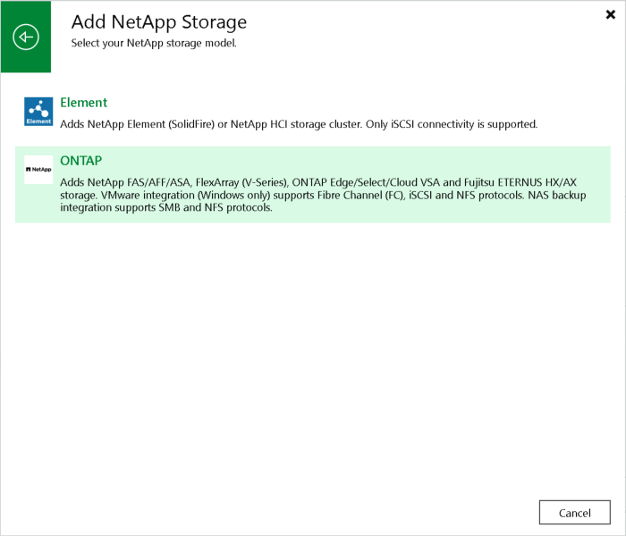

# Step 1. Launch New NetApp Data ONTAP Storage Wizard

To launch the New NetApp Data ONTAP Storage wizard, perform the following steps.

1. Open the Storage Infrastructure view and do one of the following:

+ In the working area, click Add Storage.
+ In the inventory pane, right-click the Storage Infrastructure node and select Add Storage.

1. In the displayed window, select NetApp > ONTAP.

|  |
| --- |
| Tip |
| If you have at least one NetApp ONTAP, Fujitsu ETERNUS HX/AX, Lenovo ThinkSystem DM/DG storage system in the backup infrastructure, you can select the <NetApp storage model name> node in the inventory pane, right-click anywhere in the working area and select Add storage. |

