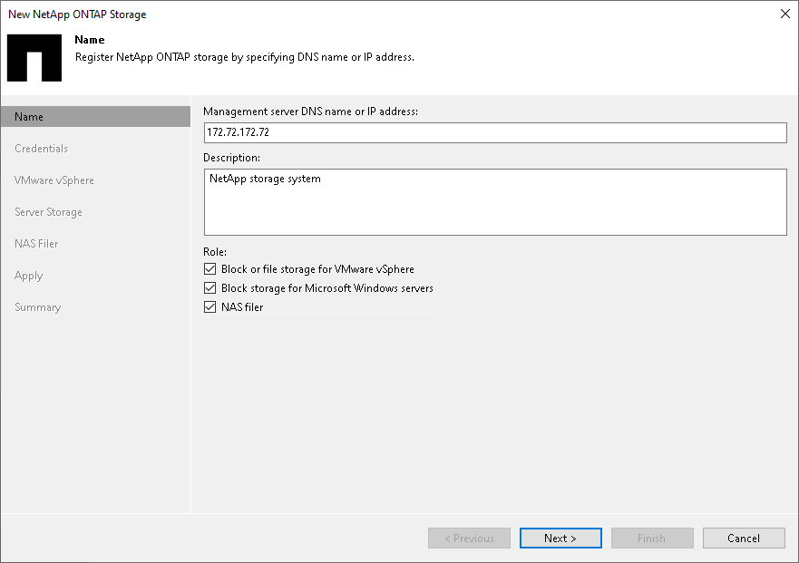

# Step 2. Specify NetApp Server Name or Address and Storage Role

At the Name step of the wizard, specify the storage system name, description and storage role.

1. In the Management server DNS name or IP address field, specify a DNS name, or IPv4 or IPv6 address of the storage system. Note that you can use IPv6 addresses only if IPv6 communication is enabled as described in the [IPv6 Support](ipv6.md) section in the Veeam Backup & Replication User Guide.
2. In the Description field, provide a description for future reference. The default description contains information about the user who added the storage system, date and time when the storage system was added.
3. In the Role section, select the types of backup jobs that are allowed to access this storage system:

1. Select the Block or file storage for VMware vSphere check box to allow VMware backup.
2. Select the Block storage for Microsoft Windows servers check box to allow backup of Veeam Agents.
3. Select the NAS filer check box to allow NAS backup.

This is the only available option for the Linux-based backup server.

When you select any of these check boxes, additional steps of the wizard will appear.

If you do not select any check box, Veeam Backup & Replication displays an error. To proceed with the wizard, select at least one check box.

