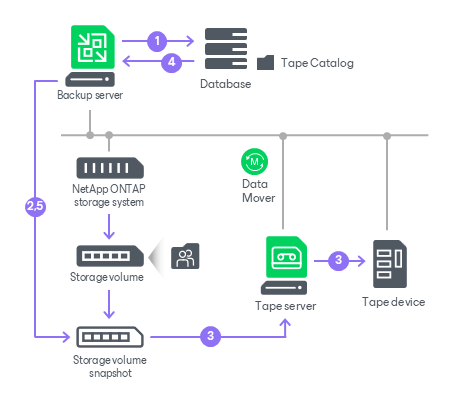

# NetApp NDMP Server Backup to Tape

You can use the SnapMirror to Tape (SMTape) functionality built into in the NetApp ONTAP storage system to perform volume backup to tape by the NDMP protocol. SMTape is a NetApp technology that writes NetApp volume data directly to tape from storage-side snapshots. The volume deduplication and compression are preserved in the process. Unlike other types of file to tape backup jobs, the NetApp NDMP server backup to tape is performed at the block and volume levels.

To back up data from NetApp NDMP servers, you need to create a file to tape job. For more information, see [Creating File to Tape Jobs](creating_file_to_tape_jobs.md).

Backup Infrastructure

For NetApp NDMP servers, Veeam Backup & Replication treats each NetApp data-management IP address (data LIF) as a separate NDMP server.

|  |
| --- |
| Note |
| Veeam Backup & Replication does not support automatic creation of NetApp NDMP servers during a rescan of an added NetApp storage system. You must add each NetApp data LIF as an NDMP server separately. For more information, see [Adding NDMP Servers](adding_ndmp_servers.md). |

During a job run, Veeam Backup & Replication performs the following operations:

1. Veeam Backup & Replication checks the backup chain to determine whether to run a full or an incremental backup.
2. Veeam Backup & Replication creates a snapshot of the NDMP volume using the existing NetApp storage integration. At any time, at most two snapshots can exist on the volume for the job: one from the previous run and one from the current run.

For incremental backups, Veeam Backup & Replication uses the snapshot from the previous run as the base snapshot and writes only the blocks that changed since that snapshot to tape.

1. Veeam Backup & Replication connects to Veeam Data Movers at the gateway server and writes the volume data from the snapshot to tape at the block level, preserving the deduplication and compression applied on the NetApp storage.

In case the NDMP server has automatic gateway server selection enabled, the tape server is automatically added to the list of available gateway servers for this backup session and is used by default.

1. The NDMP volume version is recorded in the configuration database.
2. Veeam Backup & Replication removes the snapshot that was created during the previous run.

Requirements for NetApp NDMP Servers

Before you add a NetApp NDMP server to the tape infrastructure, check the following requirements:

* NDMP version 4 or higher is supported.
* The SMTape functionality is available only in the NetApp Storage Virtual Machine (SVM) scoped NDMP mode.
* The NetApp SVMs that you plan to back up must be configured to use the NDMP protocol. For more information, see [NetApp Docs](https://docs.netapp.com/us-en/ontap/ndmp/index.html).

Limitations for NetApp NDMP Servers

If you plan to back up NetApp NDMP servers, consider the following:

* The NetApp NDMP server backup to tape functionality is available in Veeam Data Platform Advanced and above. This functionality consumes Veeam instance or capacity pack licenses. For more information, see [Instance Consumption for Object Storage Backup, File Backup and File to Tape Jobs](nas_licensing.md).

* Only backup of a whole volume is supported.
* Veeam Backup & Replication supports only the incremental SMTape backup mode. The first backup in a chain is a full backup; subsequent runs are incremental.

* For the NetApp NDMP server backup to a media pool with the Process independent data sources simultaneously option enabled, Veeam Backup & Replication processes NDMP volumes in parallel, with each volume written by a separate drive. For more information, see [Tape Parallel Processing](parallel_processing.md).

Related Topics

* [File Backup to Tape](file_to_tape_jobs.md)
* [Restoring NetApp NDMP Volumes from Tape](netapp_ndmp_restore.md)

Page updated 2026-07-28

