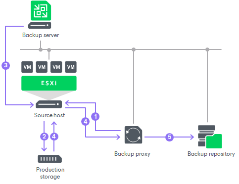

# Network Mode

The Network mode can be used with any infrastructure configuration. In this mode, data is retrieved through the ESXi host over LAN using the Network Block Device protocol (NBD).

The Network mode has low data transfer speed over LAN. To take the load off the LAN, Veeam Backup & Replication provides two alternative modes: [Direct Storage Access](direct_storage_access.md) and [Virtual Appliance](virtual_appliance.md). However, the Network mode is the only applicable mode when the VMware backup proxy role is assigned to a physical machine and the host uses local storage. Also, the Network mode can be the best choice if you have a large virtual environment with hundreds of small VMs, with 10 Gb Ethernet networks and with a small change rate.

The process of data retrieval in Network mode includes the following steps:

1. The VMware backup proxy sends a request to the ESXi host on which the processed VM is registered to locate the VM on the datastore.
2. The ESXi host locates the processed VM on the datastore.
3. Veeam Backup & Replication instructs VMware vSphere to create a VMware vSphere VM snapshot.
4. ESXi host copies VM data blocks from the source storage and sends them to the VMware backup proxy over LAN.

Note that the real data transfer speed may be significantly less than the available speed. This is because the VMware backup proxy and the ESXi host communicate over the ESXi management network.

1. The VMware backup proxy sends the data to target.

Veeam Backup & Replication processes VM disks in parallel. If VM disks are located on different storage types (for example, on the SAN and local storage), Veeam Backup & Replication uses different transport modes to process VM disks. In such scenario, it is strongly recommended that you select the Failover to network mode if primary mode fails, or is unavailable option when configuring the mode settings for the VMware backup proxy.

Related Topics

* [Failover to Network Mode](network_mode_failover.md)
* [Adding VMware Backup Proxies](add_vmware_proxy.md)

