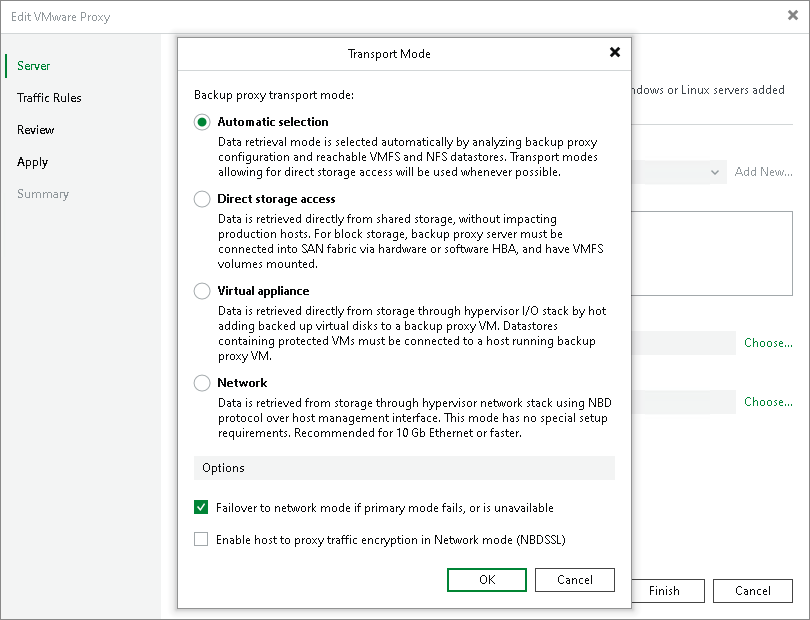

# Failover to Network Mode

In this article

You can instruct Veeam Backup & Replication to switch to the Network transport mode and transfer VM data over LAN if the primary transport mode — Direct storage access or Virtual appliance — fails during the job session. This option is enabled by default to ensure that jobs and tasks can be completed successfully in any situation. In scenarios when the data cannot be processed by other transport modes, failover to the Network transport mode applies automatically even if the failover option is disabled.

Note that data transport over LAN puts additional load on your production network and may potentially affect performance if you accomplish data protection and disaster recovery tasks in business hours.

Page updated 6/27/2024

Page content applies to build 13.0.1.1071
