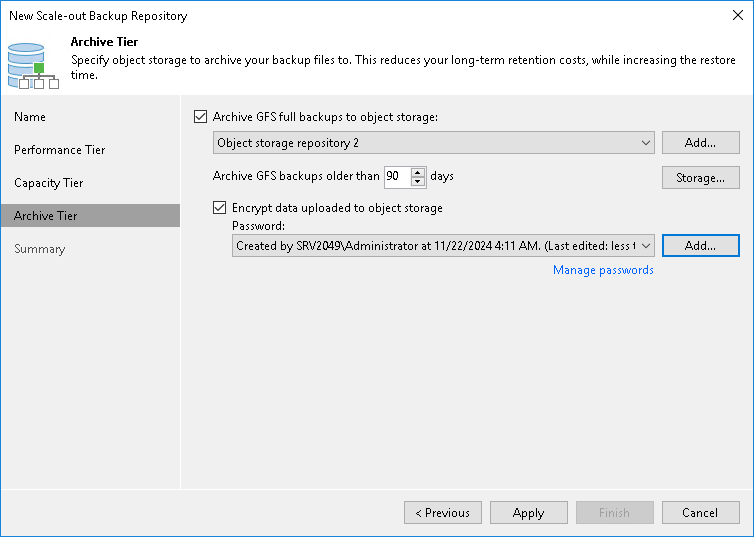
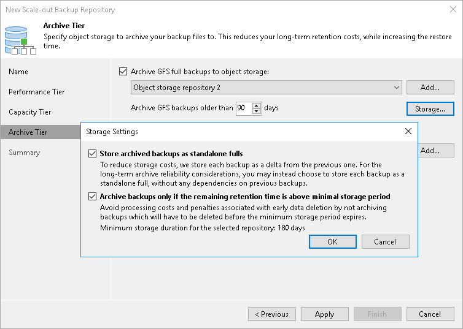

# Step 6. Add Archive Tier

Before you add an archive tier, [check the prerequisites](limitations_archive_tier.md).

At the Archive Tier step of the wizard, select an object storage repository that you want to add as an archive extent and specify data move settings.

|  |
| --- |
| Tip |
| If you have a compatible type of a repository configured as a capacity extent, you can add an archive extent to the existing scale-out backup repository. To do so, select the scale-out backup repository, click Edit Scale-out Repository on the ribbon or right-click the scale-out backup repository and select Properties. In the Edit Scale-out Backup Repository wizard go to the Archive Tier step and proceed with the following steps. |

Consider the following:

* The Archive Tier step of the wizard will appear only if you have a compatible type of repository configured as a capacity extent or a performance tier. For more information, see [Limitations for Archive Tier](limitations_archive_tier.md).
* You can add only one archive extent per scale-out backup repository.

To configure the archive extent, do the following:

1. Select the Archive GFS full backups to object storage check box. In the drop-down list, select one of available object storage repositories or click Add to add a new one.
2. In the Archive GFS backups older than N days field, specify the operational restore window to define a period after which inactive backup chains on your performance or capacity extent will be considered outdated and, therefore, should be moved to the archive extent. Consider that "0" is an acceptable value, which you can specify to archive inactive backup chains on the same day they are created.
3. To encrypt data in the archive extent, select Encrypt data uploaded to object storage and provide a strong password. Veeam Backup & Replication will encrypt the entire collection of blocks along with the metadata during the archive job. If you have not created the password beforehand, click Add or use the Manage passwords link to specify a new password. For more information, see [Encryption for Archive Tier](encryption_for_archive_tier.md).

|  |
| --- |
| Note |
| If you have encryption on the capacity tier level, but do not enable encryption on the archive tier level, the backups will not be encrypted in the archive tier. |

Specifying Storage Settings

You can use the default storage settings or specify them manually. For that, click Storage.

* Select the Store archived backups as standalone fulls check box to forbid reuse of the data blocks.
* Select the Archive backups only if the remaining retention time is above minimal storage period check box to specify which data blocks can be transported to the archive tier.

When you add as an archive extent an object storage repository that contains archived backup data, you will be prompted to synchronize existing backup chains with data in this scale-out backup repository. After the synchronization is complete, the existing backups will become available as Imported and will be displayed in the Home view, under the Archive Tier (Imported) node in the [inventory pane](vbr_ui.md).

