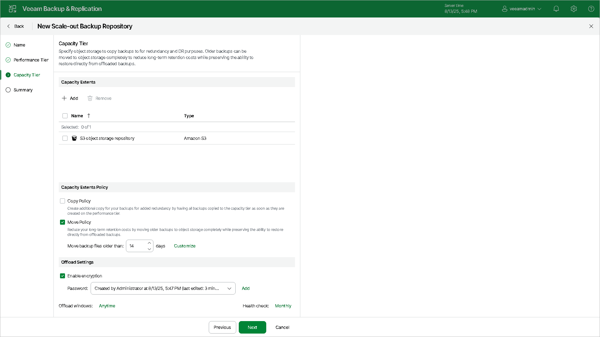

# Step 5. Add Capacity Tier

In this article

Before you add a capacity tier, [check the prerequisites](capacity_tier_limitations.md).

At the Capacity Tier step of the wizard, select object storage repositories that you want to add as capacity extents. Then specify the capacity extents policy and the offload settings.

|  |
| --- |
| Tip |
| If you already have a scale-out backup repository in your backup infrastructure and you want to add a capacity tier, select the scale-out backup repository, click Edit Scale-out Repository on the ribbon or right-click the scale-out backup repository and select Properties. In the Edit Scale-out Backup Repository wizard go to the Capacity Tier step and proceed with the following steps. |

To configure capacity tier, do the following:

1. Click Add to open the Extents window.
2. In the Extents window, select check boxes next to backup repositories or object storage repositories that you want to add as capacity extents.
3. Click Add.
4. Select the Copy Policy check box to copy new backups as soon as they are created, as described in section [Copying Backups to Capacity Tier](capacity_tier_copy.md).

When selecting this option, you will be asked whether to copy all backup files that you may already have on any of the performance extents, or only those that have been created recently.

If you select Latest, only backup files that belong to the last active backup chain will be copied from each of the performance extents. If you select All, Veeam Backup & Replication will copy all backup files that belong to all backup chains located on any of the [specified](sobr_add_extents.md) extents.

1. Select the Move Policy check box to move inactive backup chains to the capacity extent, as described in section [Moving Backups to Capacity Tier](capacity_tier_move.md).

In the Move backup files older than X days field, specify the operational restore window to define a period after which inactive backup chains on your performance extents will be considered outdated and, therefore, should be moved to the capacity extent. Consider that "0" is an acceptable value, which you can specify to offload inactive backup chains on the same day they are created.

To override behavior of moving old backups, click Override, select the Move oldest backup files sooner if scale-out backup repository is reaching capacity check box and define a threshold in percent to force data transfer if a scale-out backup repository has reached the specified threshold.

1. Click Offload window and specify when it is allowed or prohibited to move or copy data to object storage.
2. To offload data encrypted, select Encrypt data uploaded to object storage and provide a strong password. With this option selected, the entire collection of blocks along with the metadata will be encrypted while being offloaded.If you have not created the password beforehand, click Add or use the Manage passwords link to specify a new password.

|  |
| --- |
| Note |
| You must enable capacity tier encryption if you want to use Veeam Data Cloud Vault as a capacity extent. |

1. If you want to specify a schedule for a health check, click the Monthly link and define the schedule settings. For more information, see [Health Check for Capacity Tier](hc_capacity_tier.md).

|  |
| --- |
| Tip |
| You can combine both the Copy Policy option and the Move policy option, as described in section [Copying Backups to Capacity Tier](capacity_tier_copy.md). |

Related Topics

* [Capacity Tier](capacity_tier.md)
* [Capacity Extent Structure](object_storage_repository_structure.md)
* [Data Transfer](capacity_tier_data_transfer.md)
* [Health Check for Capacity Tier](hc_capacity_tier.md)

Page updated 1/5/2026

Page content applies to build 13.0.1.1071
