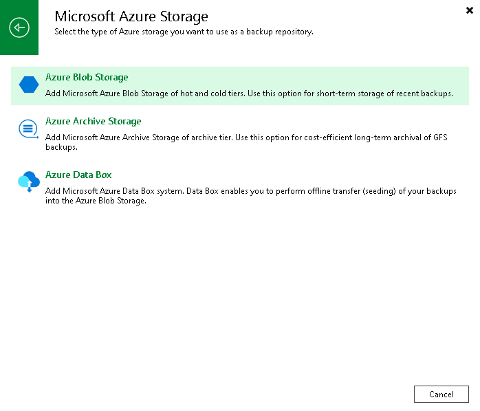

# Step 1. Launch New Object Storage Repository Wizard

In this article

To launch the New Object Storage Repository wizard, do the following:

1. Open the Backup Infrastructure view.
2. In the [inventory pane](vbr_ui.md), right-click the Backup Repositories node and select Add backup repository. Alternatively, you can click Add Repository on the ribbon.
3. In the Add Backup Repository window, select Object storage > Hyperscalers > Microsoft Azure Storage > Azure Blob Storage.

Page updated 12/6/2024

Page content applies to build 13.0.1.1071
