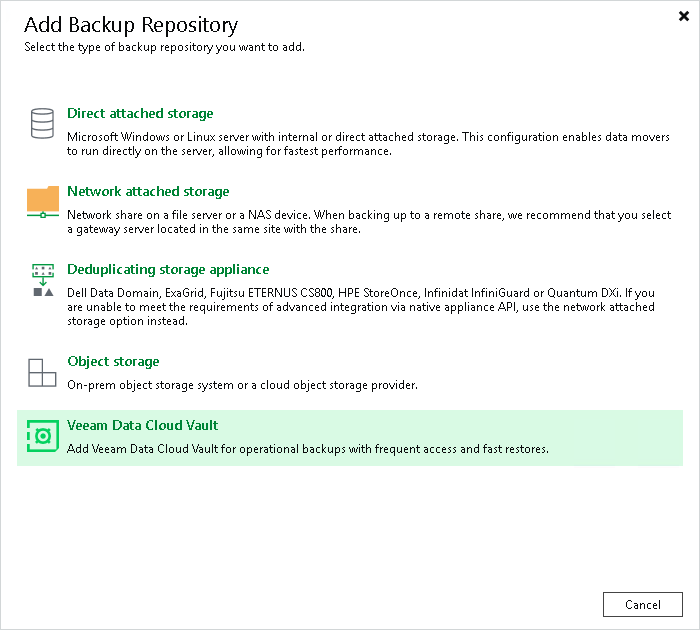

# Step 1. Launch New Object Storage Repository Wizard

To launch the New Object Storage Repository wizard, do the following:

1. Open the Backup Infrastructure view.
2. In the [inventory pane](vbr_ui.md), right-click the Backup Repositories node and select Add backup repository. Alternatively, you can click Add Repository on the ribbon.
3. In the Add Backup Repository window, select Veeam Data Cloud Vault. Alternatively, you can select Object storage > Veeam Data Cloud Vault.
4. In the Veeam Data Cloud Vault window, select Veeam Data Cloud Vault Archive.

Page updated 2026-06-17

