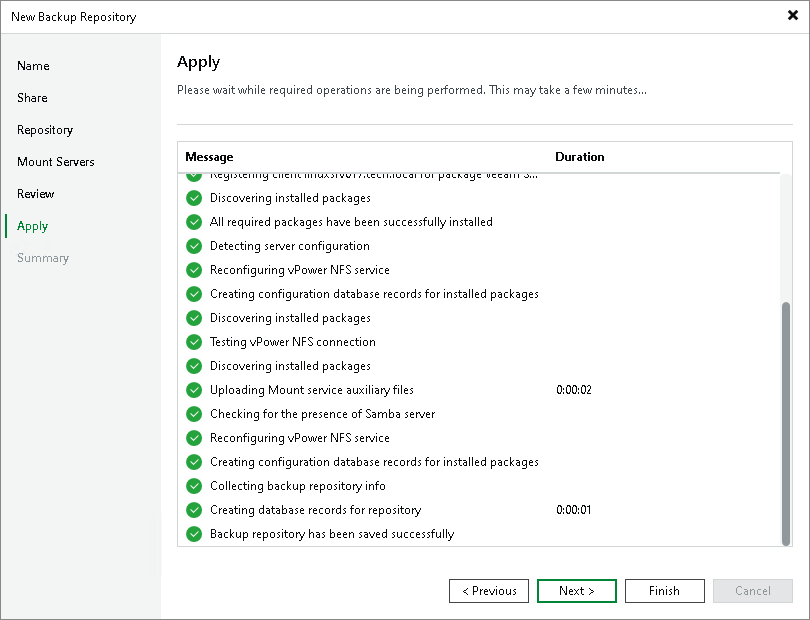

# Step 7. Apply Backup Repository Settings

At the Apply step of the wizard, wait for Veeam Backup & Replication to install and configure all required components. Then click Next to complete the procedure of adding the backup repository to the backup infrastructure.

