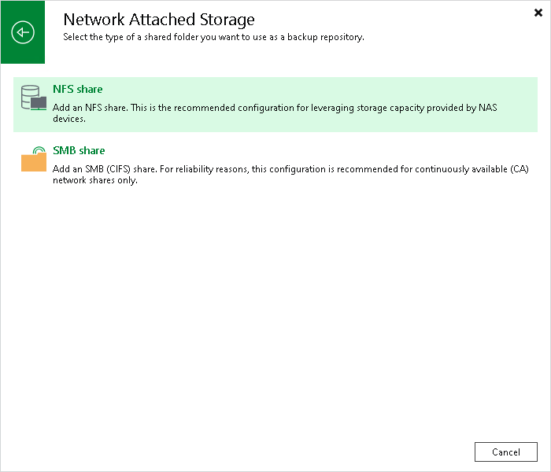

# Step 1. Launch New Backup Repository Wizard

To launch the New Backup Repository wizard, do the following:

1. Open the Backup Infrastructure view.
2. In the [inventory pane](vbr_ui.md), right-click the Backup Repositories node and select Add Backup Repository. Alternatively, you can click Add Repository on the ribbon.

1. In the Add Backup Repository window, select Network Attached Storage > NFS share.

