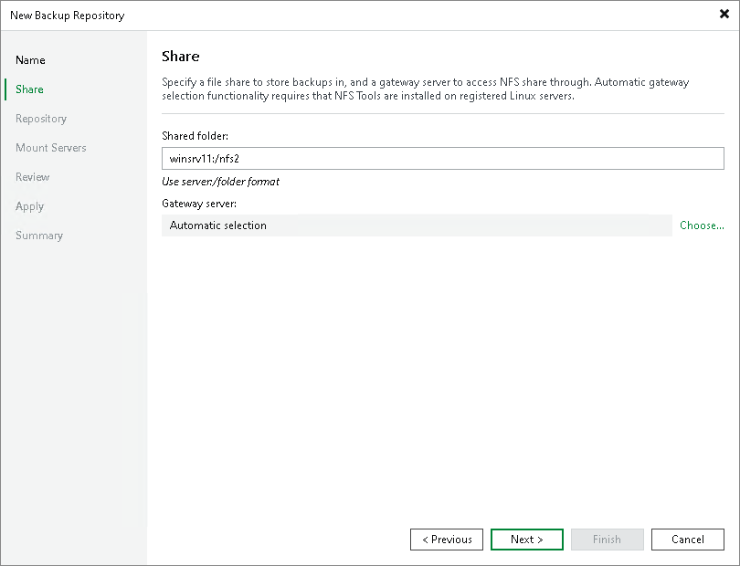

# Step 3. Specify Shared Folder Settings

To configure settings for an NFS share:

1. In the Shared folder field, specify a path to the NFS shared folder that you want to use as a backup repository. You can specify the path using an IPv4 or IPv6 address. Note that you can use IPv6 addresses only if IPv6 communication is enabled as described in section [IPv6 Support](ipv6.md).
2. In the Gateway server field, specify which gateway server you want to use:

* If you want Veeam Backup & Replication to select a gateway server automatically, leave Automatic selection.
* If you want to select servers that can be used as gateway servers explicitly, click Choose next to the Gateway server field. In the Gateway Server window, click Use the following gateway servers only and select servers. The servers must have a direct access to the NFS share and must be located as close to the NFS share as possible. Veeam Backup & Replication will choose the most suitable server.

For more information on the gateway servers, their requirements and limitations, and how they are selected, see [Gateway Servers](gateway_server.md).

