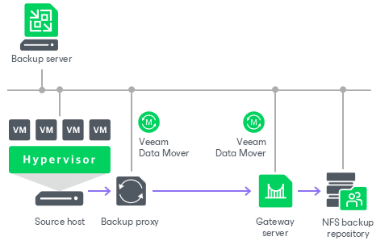

# NFS Share

You can use NFS shares as backup repositories.

NFS Backup Repository Deployment

To communicate with an NFS backup repository, Veeam Backup & Replication uses two [Veeam Data Movers](veeam_transport_service.md) that are responsible for data processing and transfer:

* Veeam Data Mover on the VMware or off-host backup proxy
* Veeam Data Mover on the gateway server

|  |
| --- |
| Note |
| Windows-based gateway servers cannot be used for NFS shares with krb5i and krb5p support. |

An NFS share cannot host Veeam Data Movers. For this reason, to communicate with the NFS share, you need to deploy a gateway server. Veeam Backup & Replication will automatically deploy a Veeam Data Mover on this gateway server. For more information, see [Gateway Servers](gateway_server.md).

When any job addresses the NFS backup repository, Veeam Data Mover on the gateway server establishes a connection with Veeam Data Mover on the VMware or off-host backup proxy, enabling efficient data transfer over LAN or WAN.

If you plan to move VM data to an off-site NFS repository over a WAN link, it is recommended that you deploy an additional gateway server in the remote site, closer to the NFS repository.

Requirements and Limitations for NFS Backup Repositories

A machine performing the role of an NFS repository must meet the following requirements:

* The machine must meet the system requirements. For more information, see [System Requirements](system_requirements.md#target).

* The role of the NFS repository can be assigned to a Microsoft Windows or Linux machine (physical or virtual) or to NAS storage supporting NFS protocol.
* The NFS repository must present read and write access rights to the gateway.
* [For NFS repositories with Microsoft Windows gateway servers] The repository must support NFS protocol versions 3.0 and 4.1. Versions 4.0 and 4.2 and other minor versions are not supported.
* [For NFS repositories with Microsoft Windows gateway servers] For NFS servers using v4.1 protocol, the delegation feature must be disabled.
* [For NFS repositories with Linux gateway servers] The repository supports any NFS protocol version that the Linux gateway server can mount.
* [For NFS repositories with Veeam Software Appliance as gateway server] Make sure that the export option on the NFS share is set to all\_squash. Otherwise, the gateway server will not able to work with the share.
* [For NFS servers using v3 protocol] The NFS server must support the READDIRPLUS command.
* NFS referrals must be disabled.

Note that Veeam Backup & Replication does not support multipathing for NFS repository.

Requirements for Gateway Server

A machine performing the role of a gateway server for communication with the NFS backup repository must meet the following requirements:

* The role of the gateway server can be assigned to a Microsoft Windows or Linux machine (physical or virtual). The machine must meet the system requirements. For more information, see [System Requirements](system_requirements.md#gateway).

* You must add the machine to the Veeam Backup & Replication console as a managed server.
* [For automatic gateway selection] The backup server must have read and write access in the NFS repository.
* [For automatic gateway selection] If you configure automatic gateway selection for NFS repository, Veeam Backup & Replication may use the same machines as gateways for the repository and as proxies for backup jobs. Make sure that the backup proxies meet the following requirements:

* If you explicitly choose backup proxies for backup jobs, provide read and write access rights to all proxies chosen for backup jobs that are targeted to the NFS repository.
* If you configure automatic proxy selection for backup jobs, provide read and write access rights to all proxies in the Veeam Backup & Replication infrastructure.
* If backup jobs that are targeted to the NFS repository use Linux proxies, check that the NFS client package is installed on the Linux-based proxy server.

Requirements and Limitations for Linux Gateway Server

In addition to the general requirements, the Linux gateway server must meet the following requirements:

* The Linux gateway server must have NFS client package installed.
* The credentials to authenticate with the Linux gateway server must have root or elevated to root permission.
* Veeam Backup & Replication uses the highest NFS protocol version supported by the gateway and the repository.

Note that the suffix indicating the NFS version in the NFS share properties may not be displayed correctly, this is a known issue.

|  |
| --- |
| Tip |
| If the NFS protocol version has changed (for example, if you updated the NFS share), click through the Edit Backup Repository wizard to update the information in Veeam Backup & Replication. |

Related Topics

* [Adding NFS Repositories](nfs_repository_add.md)
* [Gateway Servers](gateway_server.md)

