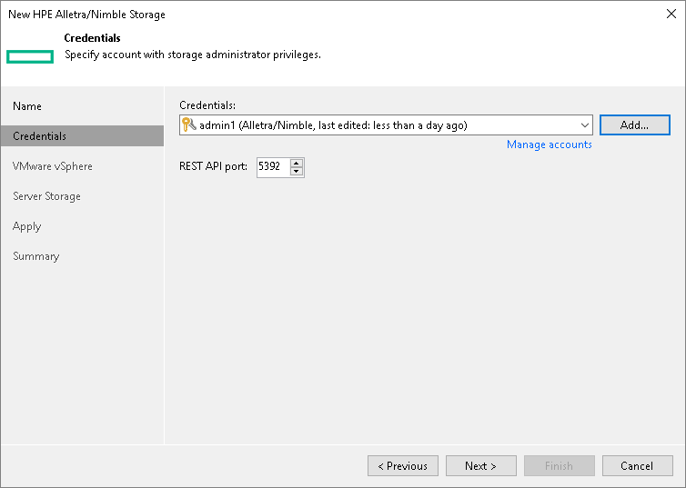

# Step 3. Specify Credentials

In this article

At the Credentials step of the wizard, specify credentials for a user account with administrator privileges on the storage system.

1. From the Credentials list, select credentials to connect to the storage system. If you have not set up credentials beforehand, click the Manage accounts link or click Add on the right of the Credentials field to add the credentials. For more information, see the [Credentials Manager](credentials_manager.md) section in the Veeam Backup & Replication User Guide.

The user account that you select must have Administrator or Power User permissions on the HPE Alletra 5000, 6000, Nimble storage system.

1. Veeam Backup & Replication uses HPE Alletra 5000, 6000, Nimble RESTful API to communicate with the storage system. By default, commands to the RESTful API server are sent over port 5392. If you use another port for HPE Alletra 5000, 6000, Nimble RESTful API, you can change the port number.

1. When you add a storage system, Veeam Backup & Replication saves to the configuration database a thumbprint of the TLS certificate installed on the management server.

During every subsequent connection to the server, Veeam Backup & Replication uses the saved information to verify the server identity and avoid man-in-the-middle attacks.

If the certificate installed on the server is not trusted, Veeam Backup & Replication displays a warning.

+ To view detailed information about the certificate, click View.
+ If you trust the server, click Continue.
+ If you do not trust the server, click Cancel.

Veeam Backup & Replication will display an error message, and you will not be able to connect to the server.

Page updated 4/17/2025

Page content applies to build 13.0.1.1071
