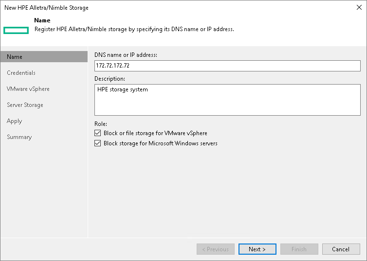

# Step 2. Specify Storage Name or Address and Storage Role

In this article

At the Name step of the wizard, specify the storage system name, description and storage role.

|  |
| --- |
| Note |
| Make sure that the Access setting is set to Volume Only for VMware hosts on all HPE Alletra 5000, 6000, Nimble volumes that are used as VMware datastores.  If the Access setting within the HPE Alletra 5000, 6000, Nimble storage system is set to Volume & Snapshots for VMware hosts, the VMware host detects all snapshots as volumes at volume rescan when Veeam Backup & Replication mounts HPE Alletra 5000, 6000, Nimble snapshots to a proxy. When Veeam Backup & Replication subsequently unmounts the snapshots after the backup is complete, alerts and alarms may be triggered on the VMware host regarding inaccessible storage. The VMware host can even become unresponsive as a result. Be aware, the VMware hosts may require a reboot during a maintenance period for the new LUN access permissions to take effect. |

1. In the DNS name or IP address field, specify a DNS name or IPv4 address of the storage system.
2. In the Description field, provide a description for future reference. The default description contains information about the user who added the storage system, date and time when the storage system was added.
3. In the Role section, select the types of backup jobs that are allowed to access this storage system:

1. Select the Block or file storage for VMware vSphere check box to allow VMware backup.
2. Select the Block storage for Microsoft Windows servers check box to allow backup of Veeam Agents.

When you select any of these check boxes, additional steps of the wizard will appear.

If you do not select any check box, Veeam Backup & Replication displays an error. To proceed with the wizard, select at least one check box.

Page updated 3/15/2024

Page content applies to build 13.0.1.1071
