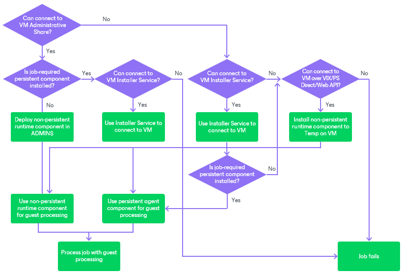
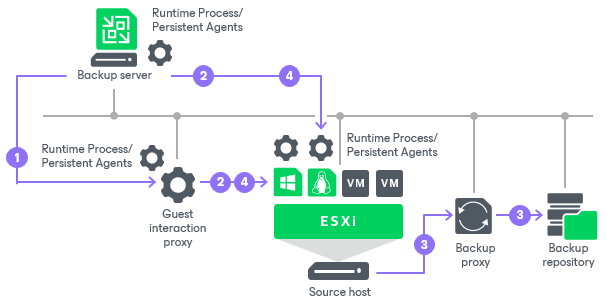

# Non-Persistent Runtime Components

In this article

Non-persistent runtime components help to avoid agent-related drawbacks such as pre-installing, troubleshooting and updating. These components are deployed on every VM added to the job when the job starts. As soon as the job finishes, the components are removed. This method is used for guest processing by default.

To use non-persistent runtime components, do not select the Use persistent guest agent check box when specifying application-aware processing settings as described in section [Application-Aware Processing](backup_job_vss_application_vm.md) for VM backup jobs. By default, Veeam Backup & Replication performs processing of the backup jobs with enabled guest processing according to the following algorithm.

|  |
| --- |
| Note |
| If the Use persistent guest agent option is disabled but persistent agent components were previously installed on the VM, Veeam Backup & Replication may use them for guest processing. To use non-persistent runtime components, uninstall persistent agent components from protected VMs. |

Veeam Backup & Replication deploys the non-persistent runtime components on VMs in two ways:

* For VMs running Microsoft Windows, non-persistent runtime components are deployed using guest interaction proxies. For more information, see [Guest Interaction Proxies](guest_interaction_proxy.md). If there are no guest interaction proxies or guest interaction proxies fail for some reason, Veeam Backup & Replication will deploy non-persistent runtime components on Microsoft Windows VMs from the backup server.
* For VMs running Linux or Unix operating systems, non-persistent runtime components are deployed from the backup server.

When you start a job with guest processing tasks enabled, Veeam Backup & Replication performs the following operations:

1. Veeam Backup & Replication defines the machines that will perform the guest interaction proxy role.
2. Veeam Backup & Replication deploys the non-persistent runtime components and security certificates on VMs:

* [For Microsoft Windows VMs] The guest interaction proxy connects to VMs and deploys the non-persistent runtime components on them.

* [For VMs running Linux or Unix] The backup server connects to VMs and deploys the non-persistent runtime components on them.

1. The job session proceeds as usual.
2. When the job session is complete, Veeam Backup & Replication deletes the non-persistent runtime components and security certificates on VMs.

If a network connection breaks during the job session, Veeam Backup & Replication makes attempts to re-establish the connection:

* If a network connection between the backup server/guest interaction proxy and VM guest OS breaks, Veeam Backup & Replication makes one attempt to reconnect.
* If a network connection between the backup server and guest interaction proxy breaks, Veeam Backup & Replication makes 10 attempts to reconnect.

If attempts are unsuccessful, guest processing tasks fail. The job proceeds with the scenario defined in the job settings. For example, if you have instructed a backup job to try application processing but ignore failures, Veeam Backup & Replication will not perform guest processing tasks but will proceed with the VM backup.

Related Topics

* [Guest Interaction Proxies](guest_interaction_proxy.md)
* [Creating Backup Jobs](backup_job.md)
* [Creating Replication Jobs](replica_job.md)
* [Copying VMs](copy_job.md)

Page updated 12/15/2025

Page content applies to build 13.0.1.1071
