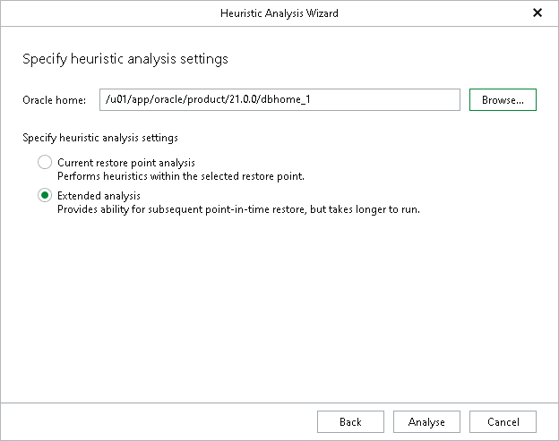
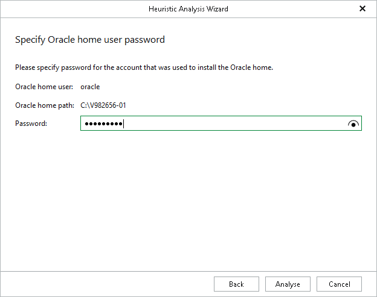

# Step 3. Specify Heuristic Settings

At this step of the wizard, do the following:

1. In the Oracle home section, enter the path to the Oracle home. This will attach a database, apply log files (if required) and make a consistency check of the database.
2. In the Specify heuristic analysis settings section, select either of the following options:

* Current restore point analysis. Select this option to search for available Oracle databases within the selected restore point only.
* Extended analysis. Select this option to search for available Oracle databases within multiple restore points.

Typically, Veeam Explorer for Oracle scans 3 restore points; the current restore point that you select when opening Veeam Explorer for Oracle, and 2 other restore points that come before and after the current restore point.

1. Click Analyse to start the heuristic analysis. Once the analysis is complete, Veeam Explorer for Oracle will load the available Oracle databases.

[For Windows-based Oracle servers] If the user specified in the job is not the Oracle home user, you must provide a password to access the target Oracle home. Applicable to Oracle 12c and later versions.

You can enter the Oracle home user password when you configure the staging server. For more information, see [Configuring Staging Oracle Server](veor_staging_server.md#staging_windows).

