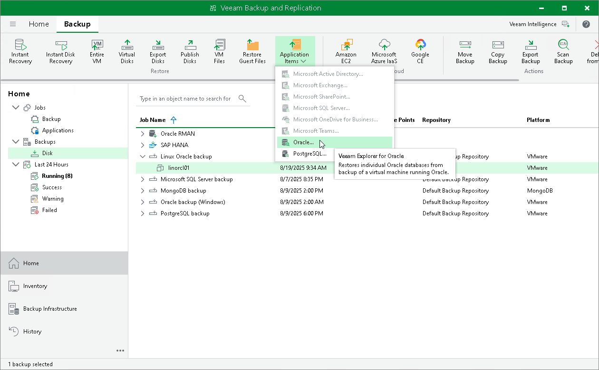

# Step 1. Launch Heuristic Analysis Wizard

To launch the Heuristic Analysis wizard, do the following:

1. In the Veeam Backup & Replication console, select the necessary backup and click Application Items > Oracle (or Windows) on the ribbon.
2. At the Restore Point step of the Oracle Database Restore wizard, select a restore point to explore.
3. Complete subsequent steps of the wizard and click Browse.

Veeam Backup & Replication will launch Veeam Explorer for Oracle and display the Heuristic Analysis wizard.

